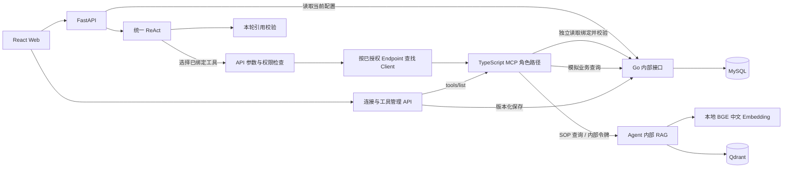

# OpsPilot

面向模拟 CRM / MES 的个人开源运营助手。Python + FastAPI + LangChain / LangGraph ReAct，TypeScript MCP，Go + Gin + GORM，MySQL，React + TypeScript。

所有业务数据来自项目的 `seed.go`，只含“模拟客户甲”等自编样例。应用不连接真实业务系统，不提供通用 SQL、Shell 或任意 HTTP 工具。

## 当前可用能力

- 普通对话和必要的追问；每条消息进入同一个 ReAct 运行时。
- 客户概览、未关闭工单、生产 / 交付工单查询；Agent 自主选择和组合已绑定工具。
- MCP 连接管理：按所属角色筛选、搜索、登记 / 编辑 / 停用、显式检查连接及工具目录。
- 角色工具绑定：先选择 Endpoint，再按来源 / 领域搜索并勾选工具；同名工具可按来源独立绑定。
- MySQL 持久化绑定、配置版本冲突检测、配置变更审计；API 与 MCP 每次执行时重读当前绑定。
- 真实工具调用记录、结构化业务结果、请求 ID 和安全错误展示。
- 自编中文 SOP 检索、当前轮次引用校验；客户洞察 Skill 在同一个 ReAct 中启用并收紧工具集。

全新数据库初始只有 `consultant`（运营顾问），在默认 `business` Endpoint 下绑定两个 CRM 工具；升级保留已有人工选择。默认路径是 `/mcp/consultant`，Endpoint 明确归属 `consultant`；保留稳定 ID `business` 是为了不改写已有 ToolRef，不是领域分类。一个角色可以拥有多个 Endpoint，但不能绑定其他角色的连接。CRM、MES、知识库、工作流只用于连接内部的工具模块与搜索分组。SOP 检索需手动绑定并建立索引；回访工作流仍显示“尚未接通”。写操作在审批链路完成前始终拒绝。

旧 `/mcp`、`/mcp/crm`、`/mcp/mes` 不再是默认部署路径。一次性迁移把原默认连接调整为运营顾问连接；旧的未归属或归属冲突连接停用并保留记录，不删除数据、不清空工具选择。自定义连接需维护者明确分配角色并部署对应角色身份，不能仅修改展示名称。现行规格见 [角色 Endpoint 修正](docs/changes/role-endpoints.md)。

Task 审批、Redis、30 条评测集和全栈 Docker Compose 仍是后续 MVP 任务。当前不提供历史会话记忆，也没有实时天气工具。SOP 与客户洞察的当前规格、测试及限制见 [客户洞察增量](docs/changes/customer-insight.md)。

## 架构



Role 保存手动选定的本角色 Endpoint 和 `{endpoint_id, tool_name}` 能力；Tool 是独立业务契约；Skill 只限制现有授权，不授予新工具。简单查询不强制加载 Skill。连接选择不做意图分类，聊天入口没有语义 Router。客户洞察可由快捷操作显式启用，也可由模型单独调用本地编排控制 `activate_skill` 启用；同一 ReAct 后续只暴露三个允许工具。API 与 MCP 都检查所属角色、当前角色版本、Skill 工具范围、来源身份和 Endpoint 执行修订号；目录元数据也核验 `opspilot/roleId`。停用或解绑会拒绝后续旧授权。已经获准并开始的读取不承诺即时取消。连接失效不会改用另一来源的同名工具。

## 目录

| 路径 | 内容 |
| --- | --- |
| `apps/agent-api` | 模型集成、ReAct、MCP Client、工具管理 HTTP API、调用校验。 |
| `data/sop`、`infra/compose.rag.yaml` | 三份自编 SOP 和仅启动 Qdrant 的开发 Compose。 |
| `apps/mcp-server` | 五个按领域定义的 MCP Tool、Zod、签名和动态绑定校验。 |
| `apps/business-service` | 自编模拟数据、限定查询、绑定配置与审计存储。 |
| `apps/web` | 聊天、快捷操作、工具管理、引用 / Task 占位界面。 |
| `scripts/dev.py` | 加载根目录 `.env` 后启动单个服务或运行真实联调。 |
| `scripts/smoke-ui.mjs` | 可选的独立 Chrome 页面交互验证。 |
| `requirements.md`、`design.md`、`tasks.md` | 需求、设计和后续实施计划。 |
| `docs/changes/tool-management.md` | 本次工具管理变更的验收标准与任务记录。 |
| `docs/changes/mcp-endpoints-*.md` | Endpoint 需求、设计及当前实施验证记录。 |

## 本地运行

需要 Python 3.12+、Go 1.25+、Node.js 22+、pnpm 和 MySQL 8。首次安装可用 `uv sync --project apps/agent-api` 创建 Python 环境；分别在 `apps/mcp-server`、`apps/web` 执行 `pnpm install --frozen-lockfile`。首次配置复制 `.env.example` 为 `.env`；已有 `.env` 时只补充缺失字段，不覆盖密钥。

| 环境变量 | 用途 |
| --- | --- |
| `LLM_API_KEY` | 模型 Key，仅后端读取。 |
| `LLM_BASE_URL`、`LLM_MODEL` | 默认 `https://api.deepseek.com`、`deepseek-flash`。 |
| `LLM_TIMEOUT_SECONDS` | 模型调用超时，默认 30 秒。 |
| `MCP_URL` | 默认连接的首次迁移地址 `http://127.0.0.1:3100/mcp/consultant`；迁移后实际连接取 MySQL 配置。已知旧默认路径有一次性迁移，自定义路径不自动改写。 |
| `MCP_CALL_SECRET` | Agent 与 MCP 共用的签名密钥，至少 32 字符。 |
| `MCP_ALLOWED_TARGETS` | 可选 JSON URL 数组；未设置时仅允许默认 URL 和本地顾问角色路径。Go 与 Agent 必须一致；首版只支持明确回环 / 私有 IP，不支持 DNS 主机名或重定向。 |
| `MCP_CREDENTIAL_PROFILES` | 可选 JSON Profile 对象：`secret_env`、`endpoint_ids`、`targets`。默认 `local` 引用 `MCP_CALL_SECRET` 并限定 business；只接受该密钥名或 `OPSPILOT_MCP_SECRET_*`。 |
| `MCP_ENDPOINT_DEFINITIONS` | 可选 MCP 部署 JSON 数组：`id/role_id/path/domains`，可选受限 `secret_env`；默认仅运营顾问连接。`domains` 是连接内部可注册的工具模块，不是 Endpoint 分类。登记连接不会启动新服务。 |
| `BUSINESS_BASE_URL` | Agent 和 MCP 访问 Go，通常为 `http://127.0.0.1:8082/`。 |
| `INTERNAL_SERVICE_TOKEN` | Agent、MCP、Go 共用的内部服务令牌，至少 16 字符。 |
| `BUSINESS_DATABASE_DSN` | Go 连接项目专用 MySQL 的 DSN，含 `parseTime=true`。 |
| `BUSINESS_LISTEN_ADDR` | 默认 `127.0.0.1:8082`。 |
| `APP_ENV` | 本地管理页要求 `development`。 |
| `SEED_DATE` | 首次生成模拟数据的日期基准；重新播种可能更新模拟记录。 |
| `QDRANT_URL` | 内部向量库，默认 `http://127.0.0.1:6333`，只接受回环/私有 IP。 |
| `RAG_BASE_URL` | MCP 访问内部检索接口，默认 `http://127.0.0.1:8000/`。 |
| `QDRANT_IMAGE` | 开发 Compose 镜像，默认 `qdrant/qdrant:v1.17.0`；可用下述国内镜像代理。 |

先启动 MySQL。在当前开发机器上可启动已有项目容器：`docker start opspilot-mysql-dev`（端口 `127.0.0.1:3307`）。其他机器请提供自己的项目专用 MySQL 和 DSN。首次初始化业务数据，按业务服务 README 运行 `cmd/seed`；服务启动会自动迁移配置表，初始化时仅创建不存在的默认绑定，重启不会重置选择。

在 MCP 模块执行 `pnpm build` 后，从项目根目录分别在四个终端运行：

```bash
apps/agent-api/.venv/bin/python scripts/dev.py business
apps/agent-api/.venv/bin/python scripts/dev.py mcp
apps/agent-api/.venv/bin/python scripts/dev.py agent
apps/agent-api/.venv/bin/python scripts/dev.py web
```

### 首次启用 SOP

先安装新增 Python 依赖（已有虚拟环境）：`apps/agent-api/.venv/bin/pip install -e apps/agent-api`。从项目根目录启动向量库并索引：

```bash
QDRANT_IMAGE=m.daocloud.io/docker.io/qdrant/qdrant:v1.17.0 docker compose --env-file .env -f infra/compose.rag.yaml up -d
apps/agent-api/.venv/bin/python scripts/dev.py index-sop
```

首次索引下载公开的 BGE 中文模型到 `.cache/fastembed`（已忽略），不使用 LLM Key；聊天请求不会下载模型。若 Hugging Face 不可达，可仅为索引命令加 `HF_ENDPOINT=https://hf-mirror.com HF_HUB_DISABLE_XET=1`，下载同一公开模型。SOP 修改后重新索引并重启 Agent，以加载当前语料；重复索引幂等，旧 collection 不自动删除。Qdrant 数据保存在专用 Docker 卷中，未使用 `down -v`。

重启 Agent/MCP 后，在管理页检查 `business` 目录，并手动绑定 `knowledge.search_sop`。客户洞察还要求同时绑定两个 CRM 工具。没有这些授权时 Skill 明确拒绝，不自动勾选工具。本 Compose 仅提供 Qdrant，不是全栈一键启动。

每个终端用 Ctrl+C 停止对应服务。打开 [本地工作台](http://127.0.0.1:5173/)，侧栏“MCP 连接”按角色管理服务，“工具管理”配置角色能力。Endpoint ID、所属角色必须与部署身份一致，例如 `business / consultant → http://127.0.0.1:3100/mcp/consultant`；先检查再选择工具。保存无需重启服务；变更服务端环境白名单/密钥/部署定义则须重启对应服务。管理接口只在本机开发环境开放，`X-Demo-Role` 是演示身份，尚未实现生产认证。没有角色创建界面，现有及后续预置角色使用同一套绑定接口。

## 演示

1. 发送“你好”：正常回复，不要求客户编号，不调用业务工具。
2. 发送“查询客户 C1001 的基础信息和未关闭工单”：Agent 自主组合两个 CRM 工具，页面显示两次真实调用及模拟结果。
3. 检查运营顾问的 `business` 连接，在“工具管理”的 MES 领域勾选生产状态工具并保存，问“查询 WO-1001 的生产状态”。不需要单独创建 MES Endpoint。
4. 解绑工具或 Endpoint 后，后续调用不再获得授权；停用连接会阻止调用，但保留已选配置。绑定多个同名来源时明确指定来源或先澄清，不声称不同来源代表不同业务数据。
5. 绑定 SOP 后，发送“查询高风险客户续费 SOP”：只用知识工具即可，不需要 Skill。
6. 点“客户洞察”，发送“结合 C1001 的工单、续费风险和 SOP 给出跟进建议”：同一 ReAct 使用三个受限工具，展示 `[1]` 引用和原文卡片。引用只能来自本轮检索；无匹配或检索故障时说明限制，不展示凭空建议。
7. 回访计划仍显示“尚未接通”；不会声称已创建或外发。

查询所需依赖未启动时显示对应错误。Go / MySQL 是当前绑定事实来源，因此绑定服务不可用时聊天也会安全失败，不使用旧权限继续执行。

## 验证与已记录结果

```bash
# 项目根目录
apps/agent-api/.venv/bin/ruff check apps/agent-api scripts/dev.py
apps/agent-api/.venv/bin/pytest apps/agent-api/tests -ra

# 各模块目录
go test ./...                   # apps/business-service
pnpm typecheck && pnpm test      # apps/mcp-server
pnpm typecheck && pnpm test && pnpm build  # apps/web

# Go/MCP/MySQL 已运行后，从根目录执行
apps/agent-api/.venv/bin/python scripts/dev.py verify-bindings
# 再启动 Qdrant、建立索引和启动 Agent 后
apps/agent-api/.venv/bin/python scripts/dev.py verify-insight
# 可选：真实模型联调（使用现有 Key，会产生模型调用费用）
OPSPILOT_TEST_LIVE_MODEL=1 apps/agent-api/.venv/bin/python scripts/dev.py verify-insight
```

2026-10-08 角色 Endpoint 修正的验证记录见 [角色 Endpoint 修正](docs/changes/role-endpoints.md)。此前领域 Endpoint 版本的验证保留在旧任务文档中，不代表当前部署路径。真实模型验证仍以既有记录为准；本轮使用固定响应测试模型验证编排与授权，不产生模型准确率指标。

联调只使用已有的运营顾问连接，短暂修改 `consultant` 的工具绑定并停用/恢复其连接，最后按版本恢复原角色选择；因此只应在本地项目演示库执行。不创建领域 Endpoint，配置版本和审计保留真实测试记录。结果不是 30 条评测集或准确率报告。若已有人工配置不匹配测试连接，测试失败关闭，不替换其地址。

浏览器冒烟需先启动独立 Chrome 调试实例（端口 9225，临时 Profile，不使用日常浏览器资料），执行 `node scripts/smoke-ui.mjs`。可选 `OPSPILOT_SMOKE_INSIGHT=1 node scripts/smoke-ui.mjs` 还会真实调用客户洞察并核验引用卡片；需要两个 CRM 工具已绑定，其临时 SOP 勾选测试后恢复，也会产生模型调用费用。

修改演示配置的联调必须串行运行，期间不要同时在管理页保存配置。2026-10-08 本次记录：Python 77 passed / 3 个默认跳过；MCP 16 passed；Web 9 passed；Go 回归、真实 Qdrant 重复索引、DeepSeek 客户洞察及真实页面引用验证通过。详细过程和首次格式失败记录见 [客户洞察验证](docs/changes/customer-insight.md)，这些结果不构成模型准确率指标。

运行时审计当前为结构化日志；只有绑定变更审计已在 MySQL 持久化。引用校验保证来源、原文和轮次一致，不能证明每条自然语言建议都获得充分的语义支持；未宣称准确率。后续补齐 Task 审批与持久化执行审计，再完成 Compose 一键启动和可复现评测。
