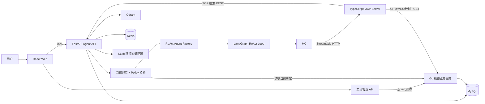
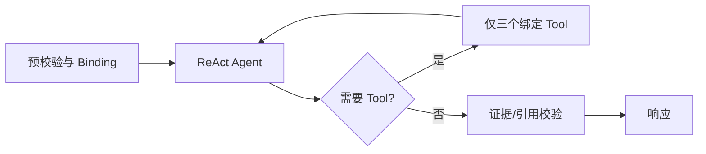
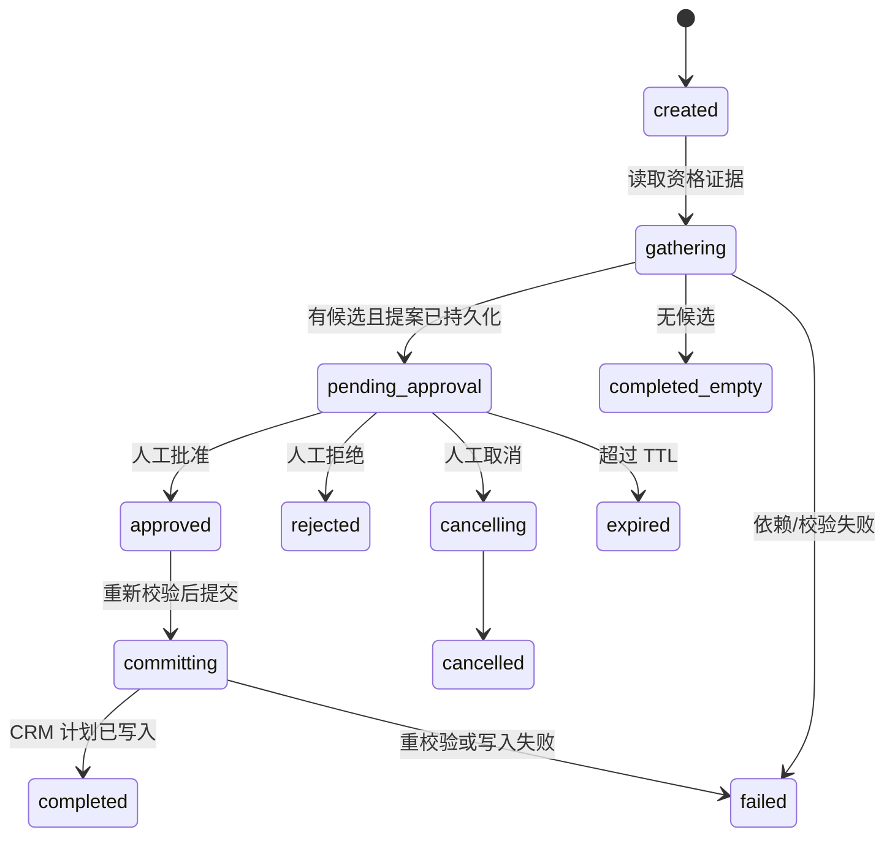

# OpsPilot：MVP 技术设计

> 2026-10-09 现行聊天与工具管理设计见 [工具管理变更规格](docs/changes/tool-management.md)，SOP/Skill 实现见 [客户洞察增量](docs/changes/customer-insight.md)，Task 现行实现见 [回访工作流](docs/changes/followup-workflow.md)。Task/决策/审计复用 Go/GORM/MySQL，最终写入与完成原子提交；Python 编排 Worker。所有聊天进入统一 ReAct，没有前置意图 Router。本文后续 Task 细节是原设计记录，有差异时以上述增量规格为准；全栈部署仍待实现。

> Endpoint 现行设计：[角色 Endpoint 修正](docs/changes/role-endpoints.md)。连接按 `role_id` 归属；角色只能绑定本角色连接，再选择其中的工具。CRM/MES 仍是连接内部的 Tool 领域。旧领域分类设计保留历史记录，不作为当前实现依据。

## 1. 设计目标与边界

本设计对应 `requirements.md` 的 MVP，并且仅覆盖其中固定的五个 Tool、两个 Skill 和一个 `consultant` Role。系统是个人开源项目，所有业务记录、SOP 和演示标识均由项目生成。

核心设计目标是将 **Role、Skill、Tool** 完全解耦：

- Role 定义可复用的 Agent 类别，由开发者通过工具管理页手动绑定 Tool 总集；Skill 另行配置；
- Tool 是具备输入/输出 Schema 的独立业务契约；
- Skill 只描述多步骤业务目标及其受限 Tool 集；
- 所有自然语言请求进入受 Binding 限制的 ReAct Agent，由 Agent 自主选择零个、一个或多个工具；
- Binding Resolver 每次都计算最小 Tool 集；
- LLM 可以选择已绑定能力，不能授予权限或修改绑定；
- 写操作在 Agent、MCP Server 和业务服务三处均受确认与策略校验。

不引入 Kubernetes、多 Agent、消息队列、复杂鉴权或额外业务域。MES Tool 默认未绑定；开发者可以在管理页绑定后查询，解绑后的请求用于越权回归测试。

## 2. 技术选型与关键决定

| 领域 | 选择 | 原因与边界 |
| --- | --- | --- |
| Agent API | Python 3.12、FastAPI、LangChain、LangGraph | LangChain 提供 `create_agent`、消息、Tool 抽象与模型集成；LangGraph 承载所有请求的 ReAct 运行时、状态和审批边界。普通请求加载该 Agent 当前已绑定、已接通的工具，不强制加载 Skill。 |
| 模型集成 | `langchain-openai` + DeepSeek OpenAI 兼容接口 | 默认使用 `https://api.deepseek.com` 与 `deepseek-flash`；Key 从环境变量读取，仍允许覆盖 Provider/模型，不自行实现一套 Agent/Tool 协议。 |
| MCP Server | Node.js 22、TypeScript、官方 MCP SDK、Zod | Tool Schema 同时用于运行时校验和服务端防线；Streamable HTTP 便于 Docker 内调用。 |
| 模拟业务服务 | Go、Gin、GORM、MySQL 8 | 由 Go 服务拥有 CRM、MES、工单、回访计划的业务数据及写入规则。 |
| 任务与审计 | FastAPI + MySQL 持久化 | 审批和审计与 Agent 请求关联，重启后仍可查询；不依赖 Redis 作为事实来源。 |
| 缓存与短会话 | Redis 7 | 缓存只读 Tool 响应、存放短会话上下文与幂等键；Redis 丢失不会改变权限或审批事实。 |
| RAG | Qdrant v1.17.0 + FastEmbed `BAAI/bge-small-zh-v1.5` | 内置中文 ONNX 模型，512 维；索引只来自自编 SOP，首次索引下载、查询仅使用本地缓存。 |
| 前端 | React、TypeScript、Vite | 实现聊天、快捷操作、引用来源、Task 状态，以及本地工具管理页。 |
| 部署 | Docker Compose | 统一启动依赖与应用；所有密钥由 `.env` 注入。 |

### 2.1 MCP Tasks 的兼容性决策

截至设计时，MCP Tasks 是通过 `io.modelcontextprotocol/tasks` 协商的扩展，客户端和服务器均须显式声明支持；其流程包含 `tools/call` 返回任务句柄、`tasks/get` 轮询、`tasks/update` 提交输入和协作式 `tasks/cancel`。官方文档还指出客户端支持并不一致，且 TypeScript SDK 的不同版本/协议时代对 Tasks 支持不同。[MCP Tasks 概览](https://github.com/modelcontextprotocol/modelcontextprotocol/blob/main/docs/extensions/tasks/overview.mdx) [TypeScript SDK 路线图](https://github.com/modelcontextprotocol/typescript-sdk/blob/main/ROADMAP.md)

因此 MVP 的默认名称与实现为 **异步任务编排**，不依赖 MCP Tasks 作为业务正确性前提。实现顺序中的兼容性验证任务必须使用官方 `ext-tasks`/Inspector 示例，确认所选版本组合真实支持以下内容后，才允许在 README 中加“已验证 MCP Tasks”说明：

1. `tools/call` 获得任务句柄；
2. `tasks/get` 状态轮询；
3. `input_required` 与 `tasks/update` 的确认输入；
4. `tasks/cancel` 请求及可观察的取消结果。

无论验证结果如何，Web UI 始终以 OpsPilot 自身的 HTTP Task API 查询、审批与取消，避免受宿主 MCP Client 能力限制。

## 3. 总体架构



### 3.1 数据与职责边界

| 组件 | 职责 | 不负责 |
| --- | --- | --- |
| React Web | 请求输入、快捷操作、引用与 Task 可视化、审批/拒绝/取消交互。 | 自行决定权限或写入合法性。 |
| FastAPI Agent API | 身份上下文、工具管理、Policy、Registry、Binding、ReAct Agent、任务/审计、RAG、对外 HTTP API。 | 直接访问 CRM/MES 表、绕过 ReAct Loop 或绕过 MCP 调用业务 Tool。 |
| MCP Server | Tool 注册、Zod 校验、服务端二次授权/风险校验、向 Go/RAG 适配调用。 | 信任 Agent 传来的 Role、写入确认或 Tool 参数。 |
| Go 业务服务 | 生成和持有模拟 CRM/MES/工单/计划数据；执行限定 REST 业务操作；写入前作最终领域校验。 | LLM 推理、RAG、Task 状态编排。 |
| MySQL | 所有模拟业务数据、Task、审批、审计的持久化事实来源。 | 缓存和向量检索。 |
| Redis | 短会话、只读响应缓存、幂等键、轮询限流。 | 权限、审批、计划写入事实来源。 |
| Qdrant | SOP chunk 向量与检索元数据。 | 生成事实、保存审批或业务记录。 |

Agent 到 MCP Server 使用内部 Streamable HTTP；MCP Server 对 Go 服务使用受 Docker 网络限制的内部 REST。仅 React 和 Agent API 暴露给宿主机。MySQL、Redis、Qdrant、MCP Server 与 Go 服务不发布主机端口。

## 4. 目录结构

```text
.
├── README.md
├── requirements.md
├── design.md
├── docker-compose.yml
├── .env.example
├── docs/
│   ├── architecture.md
│   └── mcp-tasks-compatibility.md
├── infra/
│   ├── mysql/init/
│   └── qdrant/
├── apps/
│   ├── web/                         # React + TypeScript
│   │   └── src/{features,components,api}
│   ├── agent-api/                   # Python + FastAPI + LangGraph
│   │   ├── app/{api,agent,policy,rag,tasks,audit,clients,models}
│   │   ├── config/{roles,skills}.yaml
│   │   └── tests/{unit,integration,e2e}
│   ├── mcp-server/                  # TypeScript + MCP SDK + Zod
│   │   ├── src/{tools,policy,clients,transport}
│   │   └── tests/
│   └── business-service/            # Go + Gin + GORM
│       ├── cmd/server/
│       └── internal/{crm,mes,workflow,seed,transport}
├── data/
│   ├── sop/                         # 自编模拟 SOP Markdown
│   └── fixtures/                    # 只含模拟数据的测试输入
├── evals/
│   ├── cases.jsonl
│   └── expected/
└── scripts/
    ├── seed-data
    ├── index-sop
    ├── run-evals
    └── verify-mcp-tasks
```

## 5. 配置、身份与策略模型

### 5.1 配置文件

当前聊天绑定存储于 MySQL `agent_profiles`，由 Go 内部配置接口持有；`agent_binding_audits` 保存配置变更记录。开发者通过管理页选择 `consultant` 的工具，保存使用 `expected_version` 乐观锁。启动仅初始化不存在的默认配置，不覆盖已保存绑定。`roles.yaml`、`skills.yaml` 及静态 PolicyEngine 暂保留为未来 Skill 的策略定义和单测材料，不参与当前聊天授权。新增 MCP Tool 不自动绑定。身份由本地演示的 `X-Demo-Role` 提供，默认 `consultant`。

这不是安全认证方案：它是一个最小可演示授权上下文。所有请求仍带 `actor_id`（开发环境固定为 `demo-consultant`）和 `role`，以便审计。未来接入认证时仅替换身份提供者，不改 Role/Skill/Tool 策略结构。

### 5.2 Tool Registry

Tool Registry 是 Agent 端不可变的工具元数据表；MCP 端另有同名 Zod Schema，并以启动时契约一致性测试保证两端同步。

MCP Server 的原生 Tool 按 `crm`、`mes`、`knowledge`、`workflow` 四个业务域独立定义，由中央 Registry 汇总并检查名称唯一性。每个 Tool 自带输入/输出 Schema、风险标记及单独处理器；处理器只可调用该业务能力对应的固定内部接口，不提供 GraphQL、任意 URL 或通用查询入口。实现时只借鉴参考模板的“域模块 → Tool Registry → MCP Server 注册”组织模式，不复用其业务代码、接口、标识或数据。

模型供应商的函数命名规则可能比 MCP Tool 名严格。Agent 暴露给模型的是确定性、唯一且符合函数命名规则的别名（例如 `crm__get_customer_overview`）；Role、Binding、审计与 MCP 调用始终使用原始 `crm.get_customer_overview`，模型别名不能扩大权限。

| Tool | 输入摘要 | 风险 | MCP Server 最终领域动作 |
| --- | --- | --- | --- |
| `crm.get_customer_overview` | `customer_id` | `read_only` | `GET /internal/crm/customers/{id}` |
| `crm.list_open_tickets` | `customer_id` | `read_only` | `GET /internal/crm/customers/{id}/tickets?status=open` |
| `mes.get_work_order_status` | `work_order_id` | `read_only` | `GET /internal/mes/work-orders/{id}` |
| `knowledge.search_sop` | `query`, `top_k` | `read_only` | 调用 Agent 内部 RAG 查询端点 |
| `workflow.create_followup_plan` | `propose`: `task_id`、日期窗口；`commit`: `task_id` | `approval_required` | 按窗口筛选候选并创建草稿，或提交已审批计划 |

其中 `workflow.create_followup_plan.operation` 只允许：

- `propose`：Go 服务按日期窗口与高风险条件筛选候选，返回资格证据并保存内部草稿；不创建有效回访计划。五个 Tool 中没有客户列表 Tool，因此候选筛选必须在这一受限业务操作内部完成；
- `commit`：仅当关联 Task 已获批准时，在 Go 服务创建有效计划。

`commit` 的模型可见输入不得包含“用户声称已批准”的布尔字段或审批证明；它只包含 `task_id`。执行层从已验证的 Task 状态获取一次性、短时有效的服务端审批证明。MCP Server 必须向 Agent API 的内部校验端点验证该证明和当前 Task，Go 服务还会重验 Task/审批状态。

### 5.3 Skill Registry

Skill Registry 只保存目标、允许 Tool 集、风险和图入口，不复制 Tool 实现。

| Skill | 图入口 | 允许 Tool | 风险 |
| --- | --- | --- | --- |
| `crm.customer_insight` | 统一 ReAct 中启用并收紧工具 | 客户概览、未关闭工单、SOP 检索 | `read_only` |
| `crm.followup_workflow` | `followup_workflow_graph` | 客户概览、未关闭工单、SOP 检索、回访计划 | `approval_required` |

### 5.4 当前绑定与执行点校验

工具管理模块先从 Go 读取 Agent 配置，调用 MCP `tools/list` 发现目录，核验固定 Registry 和契约指纹。模型可用集合为“手动绑定 ∩ 契约兼容 ∩ 当前已接通的工具”。保存的完整绑定集及版本进入不可变的 `AllowedToolBinding`；模型无法修改它。

每次调用先在 API 重新读取绑定，核验版本、成员、参数 Schema 与风险。随后签名请求绑定 `request_id`、Agent/Role、`route=agent`、`binding_version`、工具集合、当前工具、参数、契约指纹及短期有效期。MCP 验证签名后，再独立从 Go 读取配置并检查同一版本与授权集合。配置更新后的旧请求返回 `BINDING_CHANGED`，存储不可用则拒绝执行。部署入口不接受旧的静态 `direct_tool/skill` 上下文。

工作流的写操作仍须关联真实 Task 审批证明；当前审批未实现，因此即使管理页已绑定，写操作也不可执行。后续 Skill 执行集合必须再取当前绑定与 Skill `allowed_tools` 的交集。

## 6. 工具管理与 Agent 编排

### 6.1 工具管理接口

| 接口 | 用途 |
| --- | --- |
| `GET /api/admin/tools` | 通过官方 MCP Client 读取目录，补充领域、风险、契约兼容与已实现状态。 |
| `GET /api/admin/agents` | 返回 Agent 名称、绑定工具、配置版本。 |
| `PUT /api/admin/agents/{id}/tools` | 显式保存工具数组与 `expected_version`；冲突返回 409。 |

管理接口只在 development 环境、loopback 客户端与本地 Origin 下开放。它们不注册为 MCP Tool。前端支持名称/描述搜索、领域筛选、已选工具、参数查看与保存结果。空工具集有效；不兼容工具不可新绑定；SOP 可绑定执行，工作流仍显示“尚未接通”。目录接通不代表下游健康，未索引/故障在实际调用时安全返回。Go 内部接口均验证服务令牌，绑定更新与审计追加处于同一数据库事务。

### 6.2 统一 ReAct 运行时

使用现有安装版本的 LangChain `create_agent` 与 LangGraph 执行循环。没有聊天前置语义分类器：问候直接回复；缺参数由 Agent 追问；查询时自主选择一个或多个已授权工具。所有请求使用同一运行时，零工具调用是合法结果。未绑定能力不得调用，未查询业务记录不得编造事实，没有实时天气工具就说明限制。

模型每批调用进入中间件，先核验全部工具名和参数，再分发到调用处理器；单请求最多八次工具调用，并配置图执行步数上限。每个处理器在执行时再次检查当前绑定。响应中的 `route.kind=agent` 只是运行方式标签，不是预路由结果；`tool_calls` 记录真实名称、参数和返回数据。日志记录请求 ID、绑定版本、调用成功/失败，不记录 Prompt、密钥或内部推理。

### 6.3 普通查询时序

1. 校验 Agent 类别，读取当前绑定及可用目录。
2. 将当前可用工具提供给 ReAct Agent。
3. Agent 直接回复、追问或提出工具调用。
4. API 与 MCP 分别执行参数、版本、权限、风险检查。
5. MCP 从 Go 读取模拟业务数据，Agent 依据 Observation 回复。
6. Web 展示回复、真实工具记录、结构化结果和请求 ID。

此路径不强制加载 Skill；客户洞察启用后仍沿用同一 ReAct，不创建独立意图 Router。

### 6.4 `crm.customer_insight` ReAct 图



快捷操作通过可选 `skill_name` 显式启用；普通聊天可由模型单独调用本地 `activate_skill` 启用，两者都不是语义 Router。启用后同一 ReAct 每次模型请求仅注入三个受限 MCP Tool 适配器，取角色手动授权与 Skill 的交集。系统指令要求取得同一客户的概览和未关闭工单、检索 SOP；最终校验检查这三个步骤是否实际发生，不强制工具之间的固定顺序。模型引用输出为 `{answer, sources}` JSON，服务端转为普通回复和可信 `citations`，不接受模型生成标题/原文等元数据。

引用校验器验证 chunk 与当前源文件一致，`source_id` 属于本轮结果、回答标记与 sources 集合一致。验证失败时丢弃该次建议并说明限制，记录 `citation_validation_failed`；不得由模型补写引用。该校验不能保证所有建议在语义上被片段充分支持，需后续评测。

### 6.5 `crm.followup_workflow` ReAct 图

该 Skill 不使用 LangGraph `interrupt()` 作为审批事实来源。原因是审批必须可以在服务重启后被 Web API 明确查询、取消和幂等处理；任务表是事实来源。LangGraph 仅负责一次可重试的“生成提案”运行与一次“批准后提交”运行。



处理流程：

1. 图计算固定日期窗口 `[today, today+7]`，创建 Task 后运行带四个绑定 Tool 的 ReAct Agent；
2. Agent 调用 `workflow.create_followup_plan(operation=propose)`；Go 服务筛选 `risk_level=high` 且续费日在窗口内的客户，返回候选及资格证据并保存内部草稿。Agent 随后可用客户、开放工单和 SOP Tool 丰富提案；
3. Agent 将 Task 与草稿引用、证据、引用、输入快照一并持久化，并转为 `pending_approval`；若候选为空则转为 `completed_empty`；
4. 前端批准/拒绝/取消请求只作用于指定 `task_id`，使用幂等键；
5. 批准时 Agent 原子地从 `pending_approval` 转为 `approved`，生成一次性审批证明；随后重新读取当前客户资格和草稿参数；
6. 仅重校验通过后，调用 `workflow.create_followup_plan(operation=commit)`；MCP Server 与 Go 服务均验证证明、Task 版本和状态；
7. 成功时保存 CRM 计划 ID 并转为 `completed`；失败时转 `failed`，不产生部分有效计划。

审批并不代表以后无条件写入：客户风险或续费日期在批准后变化、提案超时、Task 已取消/终态、证明失效都会使提交失败而不写入。

## 7. 数据模型

MySQL 使用 UTC 保存时间；界面将其转换为配置的本地时区。所有业务和审计 ID 使用 UUID；业务演示 ID 如 `C1001`、`WO-1001` 是稳定可读的唯一键。

### 7.1 Go 业务服务拥有的表

| 表 | 关键字段 | 约束 |
| --- | --- | --- |
| `customers` | `id`, `customer_code`, `name`, `renewal_date`, `risk_level`, `status` | `customer_code` 唯一；风险仅 `low/medium/high`。 |
| `tickets` | `id`, `ticket_code`, `customer_id`, `title`, `status`, `severity`, `opened_at` | `customer_id` 外键；只将非终态视为 open。 |
| `work_orders` | `id`, `work_order_code`, `customer_id`, `status`, `planned_delivery_date` | `work_order_code` 唯一。 |
| `followup_plan_drafts` | `id`, `task_id`, `payload_json`, `status`, `expires_at` | `task_id` 唯一；仅 `draft/committed/expired`。 |
| `followup_plans` | `id`, `task_id`, `customer_id`, `action`, `due_date`, `created_at` | `task_id + customer_id` 唯一，保证重复提交不重复创建。 |

### 7.2 Agent API 拥有的表

| 表 | 关键字段 | 说明 |
| --- | --- | --- |
| `agent_tasks` | `id`, `skill_name`, `actor_id`, `role`, `status`, `version`, `input_snapshot_json`, `proposal_json`, `draft_id`, `result_json`, `expires_at` | Task 状态事实来源；`version` 做乐观锁。 |
| `task_approvals` | `id`, `task_id`, `decision`, `actor_id`, `decided_at`, `nonce_hash`, `expires_at` | 每 Task 最多一条有效批准；只保存证明哈希而不保存可重放明文。 |
| `audit_events` | `id`, `request_id`, `task_id`, `actor_id`, `role`, `event_type`, `outcome`, `reason_code`, `safe_context_json`, `created_at` | 追加写，不保存密钥、Header 或完整 Prompt。 |
| `chat_sessions` | `id`, `actor_id`, `summary`, `updated_at` | 可选短会话摘要；Redis 仅作为缓存副本。 |

### 7.3 SOP 与向量记录

SOP 源文件存放于 `data/sop/*.md`，每份包含 `document_id`、标题、版本、公开模拟数据声明与正文。当前 Qdrant payload 为：`document_id`、`title`、`version`、`chunk_id`、`excerpt`、`source_path`、`content_hash`。Collection 指纹绑定整份语料摘要、模型与切分版本。检索结果不直接成为业务事实，必须以当前轮次返回 chunk 构成 Citation。

## 8. 接口设计

### 8.1 Web → Agent API（公开）

| 方法与路径 | 用途 | 成功结果摘要 |
| --- | --- | --- |
| `POST /api/chat` | 提交一条用户请求 | `request_id`、`route`、消息、Tool 摘要、引用、`task_id`（如有）。 |
| `GET /api/tasks/{task_id}` | 查询任务及审计轨迹 | 状态、提案/结果、是否需人工操作、审计事件。 |
| `POST /api/tasks/{task_id}/approve` | 明确批准待审任务 | 更新后的 Task；重复调用安全返回相同终态。 |
| `POST /api/tasks/{task_id}/reject` | 拒绝提案 | 更新后的终态 Task。 |
| `POST /api/tasks/{task_id}/cancel` | 请求取消 | `cancelled` 或当前可解释状态。 |
| `GET /api/health` | 聚合健康检查 | 各必需服务的安全状态。 |

`POST /api/chat` 请求：

```json
{ "message": "查询客户 C1001 的基础信息", "session_id": "可选 UUID" }
```

直调响应示例结构：

```json
{
  "request_id": "uuid",
  "route": { "kind": "agent", "name": "crm.get_customer_overview" },
  "message": "已查询到客户 C1001 的概览。",
  "data": { "customer_code": "C1001", "risk_level": "high" },
  "binding_version": 1,
  "tool_calls": [{"name": "crm.get_customer_overview", "arguments": {"customer_id": "C1001"}, "result": {"customer_code": "C1001", "risk_level": "high"}}],
  "citations": [],
  "task": null
}
```

所有错误使用 `{error: {code, message, request_id, retryable}}`；用户不可见内部堆栈、服务地址、Prompt 或秘密。

### 8.2 Agent → MCP 与 MCP → 业务服务（内部）

Agent 通过 MCP `tools/list` 获取已注册 Tool 元数据并在启动测试时与本地 Registry 比对；正常调用仅从 Binding 中选取 Tool 名和结构化参数。

MCP Server 到 Go 服务的内部端点固定为资源化、无通用查询能力的端点：

```text
GET  /internal/crm/customers/{customer_code}
GET  /internal/crm/customers/{customer_code}/tickets?status=open
GET  /internal/mes/work-orders/{work_order_code}
POST /internal/workflow/followup-drafts
POST /internal/workflow/followup-drafts/{task_id}/commit
```

内部请求必须带服务身份和 `request_id`。Go 服务对写入调用要求：Task 当前为已批准、审批证明有效、草稿未过期、候选客户依然符合条件、Task/客户组合未提交过。MCP Server 无法通过任意 URL 或 SQL 操作 Go 服务。

Agent 的 `/internal/rag/search` 和 `/internal/tasks/{id}/write-authorization` 只在 Docker 内部网络对 MCP Server 开放；后者只返回“当前 Task 是否可提交”和短期证明，不返回审批记录细节。

## 9. 失败处理与安全控制

| 场景 | API 行为 | 审计与副作用 |
| --- | --- | --- |
| 请求模糊/缺标识 | Agent 追问，不调用缺少必要参数的 Tool。 | 零调用正常回复。 |
| LLM 工具名或参数非法 | 执行前拒绝该批动作，返回安全错误。 | 记录安全原因码。 |
| Tool 参数非法 | 返回 `INVALID_ARGUMENTS`。 | 不调用下游，不写数据。 |
| Role/Skill/Binding 越权 | 返回 `FORBIDDEN_TOOL`。 | Agent 和 MCP 都记录拒绝。 |
| 客户/工单不存在 | 返回 `NOT_FOUND`。 | 只读审计，无写入。 |
| RAG 无足够依据 | 返回确定性事实和限制，不生成 SOP 建议。 | 记录检索结果计数。 |
| LLM 不可用 | 当前统一 ReAct 聊天返回明确错误，不产生编造建议。 | `LLM_NOT_CONFIGURED` / `AGENT_UNAVAILABLE` 等安全原因。 |
| 绑定版本变化 | 返回 `BINDING_CHANGED`，要求重新发送消息。 | 拒绝下一次调用，不撤回已经完成的读取。 |
| 配置保存版本冲突 | 返回 `BINDING_CONFLICT`，保留页面未保存选择。 | 不覆盖他人的配置，不产生成功审计。 |
| MySQL/Go/MCP/Qdrant 超时 | 返回 `DEPENDENCY_UNAVAILABLE` 且标注可否重试。 | Task 进入 `failed` 或保留可重试状态；不认定成功。 |
| 重复审批/提交 | 使用 Task 版本与幂等键返回既有最终结果。 | 不创建第二个计划。 |
| Task 取消 | 仅 `pending_approval` 可立即取消；提交中的取消为协作式请求。 | 记录取消结果，不回滚已完成写入。 |

密钥仅通过环境变量加载：`LLM_API_KEY`、`INTERNAL_SERVICE_TOKEN`、`MYSQL_*`、`REDIS_URL`、`QDRANT_URL`。`.env` 被 Git 忽略，只提交 `.env.example` 的键名与非敏感默认值。日志采用结构化白名单字段并对 `authorization`、`api_key`、`token` 等键统一脱敏。

## 10. 测试与评测策略

2026-10-09 评测设计补充见 [顾问 Agent 评测驱动开发与学习设计](docs/changes/consultant-evaluation-design.md)。已给出客户洞察的业务标准 v0.1、七个评分项、三条场景及独立评测环境契约；包括时钟、数据/绑定/SOP 版本、逐 Trial 恢复与预检。下一步设计基线报告和门控；环境控制与运行器尚未实现。

### 10.1 测试层次

| 层次 | 目标 | 核心用例 |
| --- | --- | --- |
| Python 单元测试 | 工具管理、策略、Binding、Task 状态、引用校验。 | 直调不加载 Skill；Skill 集合不能扩权；非法引用被拒绝；终态不可再审批。 |
| TypeScript 单元/契约测试 | Zod Schema、MCP 二次校验、内部请求映射。 | 非法参数、伪造 Role、无效审批证明、Registry 契约不一致。 |
| Go 单元/集成测试 | GORM 查询、种子数据、草稿/提交领域规则。 | 只取 open 工单；不符合资格不能提交；唯一约束防重复计划。 |
| 服务集成测试 | Agent—MCP—Go—MySQL—Qdrant 边界。 | 四个请求、服务超时、重新校验、审批前零写入。 |
| 浏览器端到端测试 | UI 可见性和用户操作。 | 聊天、快捷操作、引用片段、Task 轮询和批准/拒绝/取消。 |
| 能力评测运行器（待实现） | 真实模型在固定场景与环境中的业务完成能力。 | 30+ 版本化样本；综合实际调用、回答、语义依据、Task 最终状态与写入副作用。 |

### 10.2 隔离原则

- 单元测试使用确定性假 MCP Client、假时钟、内存/临时数据库；不调用真实 LLM。
- 集成和 E2E 的工程规则测试可使用固定种子与注入的结构化模型响应，验证授权、引用和审批；不据此报告真实模型的选择或建议能力。Compose 测试栈仍是待实现设计。
- 离线能力评测使用真实模型及固定样本、评分标准、执行环境，可以调用模型 API。“离线”指不使用线上用户流量，不等于无网络或使用假模型。
- 真实模型冒烟、工程规则测试和正式能力评测分别报告；单次冒烟不替代版本化样本上的多次回测。
- 评测每项记录：输入、环境前提、预期业务行为与最终状态、评分项及证据；必要工具集合不强制无业务理由的固定顺序。`route.kind=agent` 只是运行方式标签，不能证明任务成功。
- 每轮记录 Agent、样本、评分标准与环境版本；保留逐 Trial 结果、原始 Trace 与业务状态，校准语义评分，区分失败、跳过与无法判定。
- 评测结果由脚本生成 JSON/Markdown，不手工编辑通过率。

## 11. Docker Compose 与运行时配置

Compose 服务：`web`、`agent-api`、`mcp-server`、`business-service`、`mysql`、`redis`、`qdrant`。启动顺序用健康检查协调：MySQL → Redis/Qdrant → Go 服务 → MCP Server → Agent API → Web。容器使用具名卷保存 MySQL 与 Qdrant 数据；`scripts/seed-data` 是唯一写入模拟业务数据的初始化入口，支持固定 `SEED_VERSION`。

必要环境变量：

```dotenv
MYSQL_DATABASE=opspilot
MYSQL_USER=opspilot
MYSQL_PASSWORD=change-me-locally
MYSQL_ROOT_PASSWORD=change-me-locally
REDIS_URL=redis://redis:6379/0
QDRANT_URL=http://qdrant:6333
LLM_BASE_URL=https://api.deepseek.com
LLM_MODEL=deepseek-flash
LLM_API_KEY=
INTERNAL_SERVICE_TOKEN=generate-a-long-random-local-token
APP_TIMEZONE=Asia/Shanghai
```

`LLM_API_KEY` 允许为空，使直接 Tool、策略、RAG 检索、Task 状态和测试可本地验证；需要自然语言建议时再配置兼容 Provider。缺少 Key 时 UI 明确展示受限能力，不伪装为完整回答。

## 12. 需求追溯与设计验证

| 需求组 | 设计落点 |
| --- | --- |
| REQ-DIRECT、REQ-POLICY | 第 5、6 节的 Registry、Binding、直调路径与 MCP 二次校验。 |
| REQ-INSIGHT | 第 6.3 节的受限图、证据结构和引用校验器。 |
| REQ-WF、REQ-SAFE-05 | 第 6.4、7、8 节的 Task 状态机、审批证明、三层重校验与幂等写入。 |
| REQ-AUTH | 第 5.1、5.4 节的初始 Role 策略和拒绝不变量。 |
| REQ-SAFE、REQ-UI | 第 8、9 节的 API、审计、错误模型、脱敏和可见状态。 |
| REQ-TEST、REQ-EVAL | 第 10 节的分层测试与固定评测设计。 |
| REQ-RUN、技术约束 | 第 2、11 节的选型、Compose、环境配置与 MCP Tasks 验证门槛。 |

## 13. 阶段结论

本设计以“先直调、再受限 Skill、最后审批写入”为最小端到端路线。下一阶段应只把这里的设计拆成 2–4 小时、具备验收标准和依赖关系的小任务，且在每个任务完成后先运行相应验证再继续。
