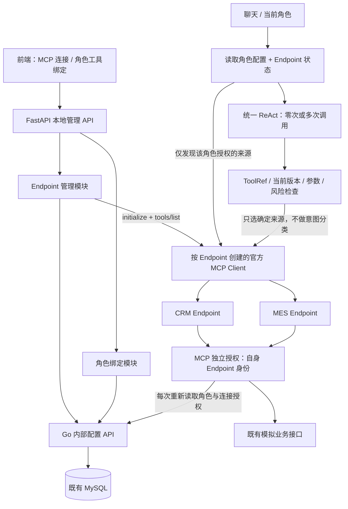

# MCP Endpoint 分类与角色绑定：技术设计草案

> 历史设计：现行角色归属、部署路径、校验与迁移方案见 [角色 Endpoint 修正](role-endpoints.md)。以下领域分类/多角色共享连接方案已被替代，不作为当前配置示例。

日期：2026-10-08。状态：用户已授权直接实施；实现及验证见 [E1–E5 记录](mcp-endpoints-tasks.md)。本文保留设计依据，实际能力以 README 为准。

依据：[REQ-ENDPOINT-01–07](mcp-endpoints-requirements.md)。本文仅设计连接管理增量；统一 ReAct、五个业务 Tool、人工确认约束均不变，不包含任务拆分或完整业务代码。

## 1. 当前代码与改动目标

当前 `main.py` 从全局 `MCP_URL` 创建一个 `OfficialMcpClient`；所有角色通过这一个 Client 发现和执行 Tool。Go 的 `AgentProfile.BoundToolsJSON` 只有工具名称，Python/MCP 授权上下文只含角色版本，没有 Endpoint 来源。前端也只有工具领域，没有连接目录。

改动后分离三个概念：

| 概念 | 标识与作用 | 不承担的职责 |
| --- | --- | --- |
| Endpoint | 固定 `endpoint_id`，描述一个 MCP 连接及展示分类 | 不替模型选择工具，不自动授权目录全部工具 |
| Role/Agent 配置 | 明确绑定的 Endpoint 集合和 ToolRef 集合 | 不通过 Prompt 授权或填写 URL |
| ToolRef | `{endpoint_id, tool_name}`，工具能力与来源的联合标识 | 不修改原 MCP Tool 名称，不强制包成 Skill |

一个角色可以连接多个 Endpoint，一个 Endpoint 可以被多个角色复用。Endpoint 分类与 Tool 领域独立；例如“综合业务”连接包含 CRM 和 MES 工具。

## 2. 架构与正常调用链



1. 后端确定当前角色，读取一致的角色配置及相关 Endpoint 记录。
2. 只探测当前角色绑定且存在已选工具的启用 Endpoint；不会连接所有注册服务。
3. 取得真实目录，交叉验证服务器来源身份、本地 Tool 契约及工具实现状态。
4. Binding Resolver 生成不可变请求快照：角色版本、每个 Endpoint 的执行修订号、ToolRef，以及模型别名到 ToolRef 的映射。
5. ReAct 自主决定直接回复、追问或调用一个/多个已授权工具。没有语义 Router。
6. 每次调用前重新校验角色与 Endpoint；用映射找到唯一 MCP Client。调用阶段不接受模型的 Endpoint 参数。
7. MCP 用自身部署身份再次校验当前授权和参数，执行对应原名 Tool；响应和日志保留来源。

不允许跨 Endpoint 同名工具替代、不允许故障自动切换到别的连接、不允许使用缓存授权继续执行。

## 3. 模块职责与目录增量

复用现有四个应用，不增加服务进程或数据库。

```text
apps/business-service/internal/
  store/models.go                Endpoint、关系表及配置审计
  store/database.go              结构迁移；不再以旧名称列表授权
  store/migrations/              一次性配置迁移与迁移版本记录
  transport/endpoints.go         连接 CRUD、探测结果条件保存
  transport/agents.go            原子保存 Endpoint + ToolRef 绑定
  transport/authorization.go     单 Endpoint 的权威授权视图
apps/agent-api/app/
  clients/bindings.py             v2 角色配置及内部配置 Client
  clients/endpoints.py            EndpointStore；不持有模型逻辑
  clients/mcp.py                  官方 MCP 会话与来源 metadata 校验
  clients/mcp_factory.py          按可信 Endpoint 描述创建 Client
  security/endpoint_targets.py    URL 白名单、凭据引用与连接目标限制
  services/endpoint_management.py 连接配置、检查与工具目录
  services/tool_management.py     角色绑定、Binding Resolver、实时授权
  services/chat.py                为 ToolRef 构建独立闭包及模型别名
  api/endpoints.py                本地管理入口
  api/tool_management.py          v2 角色能力配置入口
  models/policy.py                ToolRef 与请求绑定快照
apps/mcp-server/src/
  endpoints.ts                   部署时定义 Endpoint 身份/路径/领域
  index.ts                       一个进程挂载多个 MCP 路径
  server.ts                      按领域子集注册已有工具
  security.ts                    v2 签名与 Endpoint 来源授权
  backend.ts                     读取当前 Endpoint 授权视图
apps/web/src/
  EndpointManager.tsx             连接分类、搜索、编辑、检查、停用
  ToolManager.tsx                 角色 Endpoint 选择与 ToolRef 勾选
  api.ts                         Endpoint / v2 绑定类型与请求
  App.tsx                        两个管理入口；工具结果显示来源
```

这里的 `mcp_factory` 仅按已授权来源查找连接，不按用户 Prompt 路由。Policy 是确定性的权限、参数与风险校验。固定 Tool Registry 仍定义五个业务契约；Endpoint Registry 定义连接配置；Skill Registry 保持既有边界，未来 Skill 只能进一步收窄角色的 ToolRef 集合，不能自动加入来源。

## 4. MCP 服务部署与身份

### 4.1 一个进程、多个可独立授权的 Endpoint

第一版可用现有一个 Node 进程承载多个路径，部署配置由环境变量 `MCP_ENDPOINT_DEFINITIONS` 提供，而不是由模型或管理页修改服务注册代码。

示例仅表达结构，不包含密钥：

```json
[
  {"id":"business","path":"/mcp","domains":["crm","mes","knowledge","workflow"]},
  {"id":"crm","path":"/mcp/crm","domains":["crm"]},
  {"id":"mes","path":"/mcp/mes","domains":["mes"]}
]
```

默认无额外配置时保留 `business → /mcp`，兼容现有工具目录。CRM/MES 路径用于真实集成测试或显式启动配置，不能把未启动路径标为已连接。工具定义全局仍恰好五种，注册到不同 Endpoint 不视为新增业务 Tool。

管理页的“添加连接”只登记一个已部署服务，不自动启动进程、创建 MCP 路径或拆分业务模块。未来独立部署的项目 MCP 服务也使用同一模型。

### 4.2 Endpoint 身份不可由请求冒充

每个服务路径具有固定部署身份，工具目录的 `_meta` 加入 `opspilot/endpointId`，并保留现有 `opspilot/contractFingerprint`。所有目录项必须报告该路径的实际身份。Client 比较登记的 Endpoint ID 与实际目录身份；有工具时任何不一致均拒绝。空目录显示无工具，不能因此授予工具权限。

这些 `_meta` 是 OpsPilot 自定义扩展，不是 MCP 协议内置的角色授权。来源信任由受限部署目标和服务端凭据提供；不能仅凭远程自报 metadata 信任任意第三方服务。

Server 从部署路径取得 `own_endpoint_id`，不从签名上下文或 Tool 参数决定自己是谁。MCP 按自身已注册的工具集合校验契约和风险。

选择保留现有五工具全局契约指纹，领域子集复用该版本指纹；指纹代表本项目固定契约版本，不代表某个 Endpoint 恰好暴露全部五工具。目录缺失、名称及本地 Schema 校验仍单独执行，未知工具不可绑定。

## 5. 数据模型与一致性

### 5.1 表与字段

| 表 | 关键字段与约束 |
| --- | --- |
| `mcp_endpoints` | `id` 主键；`name`、`category`；规范化 `url` 唯一；`transport=streamable_http`；`credential_profile`；`enabled`；`version`；`execution_revision`；时间戳 |
| `agent_profiles` | 保留角色 `id/name/version`；新增 `binding_schema_version`。旧 `bound_tools_json` 保留为迁移前记录，不再参与 v2 授权 |
| `agent_endpoint_bindings` | 联合主键 `(agent_id, endpoint_id)`；外键关联角色和 Endpoint |
| `agent_tool_bindings` | 联合主键 `(agent_id, endpoint_id, tool_name)`；复合外键关联已选 Endpoint，防止出现无来源授权的 ToolRef |
| `mcp_endpoint_checks` | 每 Endpoint 最近一次检查；`checked_execution_revision`、`status`、`checked_at`、安全错误码；成功时工具目录 JSON。限制目录大小，不记录原始异常或凭据 |
| `mcp_endpoint_audits` | 追加型连接变更记录：对象、请求/操作者、前后配置及版本，无密钥 |
| `agent_binding_audits` | 复用既有绑定审计；增加 `format_version` 区分旧名称数组和 v2 连接/ToolRef 对象；旧记录不改写 |
| 配置迁移版本记录 | 记录本次迁移标识；同一事务完成后写入，防止重复迁移恢复已移除的绑定 |

建议固定限制：Endpoint ID 使用 `[a-z][a-z0-9_]{0,31}`，创建后不可改；名称 1–120 字符、分类 1–40 字符。本地首版最多登记 10 个 Endpoint，每角色最多 10 个来源、50 个唯一 ToolRef。这是资源上限，不是扩展业务工具数；原五种工具可在不同来源重复出现。

### 5.2 版本区分

- Endpoint `version`：所有人工编辑增一，用于管理页乐观锁。
- Endpoint `execution_revision`：URL、凭据引用或启用状态变化时增一；仅名称/分类修改不撤销运行时授权。
- 角色 `version`：Endpoint 或 ToolRef 选择任意变化时增一，一次保存只增一次。
- 最近检查结果不增加配置版本；带 `checked_execution_revision` 条件写入，旧连接的慢检查不能覆盖新连接结果。

保存角色能力时，Go 在事务内锁定角色及关联 Endpoint（按 ID 顺序），检查预期角色/Endpoint 版本、关联关系、固定工具名和检查记录，再一次性更新两类关系、角色版本及绑定审计。调用快照读取采用一致性事务，避免混合不同时间的角色和连接配置。

停用 Endpoint 不删除绑定，界面标为不可执行；重新启用须重新检查连接。移除角色的 Endpoint 则在同一保存操作中移除对应 ToolRef，不改变其他角色。第一版不提供物理删除 Endpoint，避免破坏审计和引用。

检查成功目录只作为管理展示和保存选择的证据；它不是权限缓存，也不是运行时可用性保证。连接修订号变化后旧检查立即失效。检查失败不使用旧目录宣称在线。运行时仍实时发现、调用前仍实时授权。

## 6. 接口设计

### 6.1 前端 → FastAPI

所有 `/api/admin` 接口沿用本地开发限制，写接口检查本机 Origin。继续返回项目统一错误对象与请求 ID。

| 接口 | 用途 |
| --- | --- |
| `GET /api/admin/mcp-endpoints` | 全部登记连接和最近检查状态；可按分类/名称过滤 |
| `POST /api/admin/mcp-endpoints` | 登记连接，初始版本 1、检查状态 unknown；不隐式发网络请求 |
| `PUT /api/admin/mcp-endpoints/{id}` | 更新展示或连接配置，要求 `expected_version`；停用也是此接口 |
| `POST /api/admin/mcp-endpoints/{id}/check` | 当前修订号下 initialize + 分页 tools/list；保存检查结果，无 Tool 执行 |
| `GET /api/admin/mcp-endpoints/{id}/tools` | 读取最近检查目录，明确检查时间、修订号和过期状态；不静默探测 |
| `GET /api/admin/agents` | 返回 v2 角色能力配置 |
| `PUT /api/admin/agents/{id}/capabilities` | 原子保存已选 Endpoint + ToolRef；要求角色版本及相关 Endpoint 版本 |

能力保存示例：

```json
{
  "expected_version": 8,
  "endpoint_ids": ["crm", "mes"],
  "expected_endpoint_versions": {"crm": 2, "mes": 1},
  "tools": [
    {"endpoint_id": "crm", "tool_name": "crm.get_customer_overview"},
    {"endpoint_id": "mes", "tool_name": "mes.get_work_order_status"}
  ]
}
```

工具卡片返回 `endpoint_id/endpoint_name/endpoint_category/tool_name/domain/input_schema/risk_level/bindable/available/status`。风险以本地 Registry 为准，不能信任远端 annotations 自动放行。

选择新工具必须来自对应当前修订号的成功检查，且通过真实目录与本地契约校验。只移除旧绑定或保存空集不要求网络在线；不能因服务故障阻止撤权。已存在但当前停用/检查失败的绑定可保留为不可执行项，不能新增不可验证的工具。

旧 `/api/admin/agents/{id}/tools` 无来源的写接口停止接受更新，返回 `BINDING_SCHEMA_CHANGED`，防止旧客户端悄悄改写多来源配置；全局 `/api/admin/tools` 不再作为授权目录，改由 Endpoint 目录取代。前后端本次同步升级，不保留含糊的双写兼容层。

### 6.2 FastAPI / MCP → Go 内部配置接口

- `/internal/mcp-endpoints`、`/{id}`：内部 CRUD，Go 同样检查目标白名单、字段及版本。
- `/internal/mcp-endpoints/{id}/check-result`：条件保存本次检查结果，需相同执行修订号；仅内部可信 Client 使用。
- `/internal/agents/{id}/bindings`：v2 配置读取、版本化保存；客户端明确声明 v2 请求结构。
- `/internal/agents/{id}/authorization?endpoint_id={id}`：返回角色版本、Endpoint ID/启用状态/执行修订号，以及仅该来源下的工具名集合。不存在的角色/连接或未绑定来源明确拒绝；不返回 URL 或凭据。

配置 CRUD/完整快照由既有内部服务令牌保护；MCP 的授权查询亦走固定 Go 地址，不接受用户指定目标。数据库记录是授权事实来源。

### 6.3 聊天与结果兼容

继续由服务端读取当前角色，不让模型修改。现有本地 `X-Demo-Role` 只用于开发演示，绝不是生产身份认证；未知角色拒绝。未来新增角色复用这些绑定接口，不在此实现角色创建或登录。

`tool_calls` 每项新增 `endpoint_id`、`endpoint_name`、`endpoint_revision`；保留 `name/arguments/result`，`name` 仍是原始工具名。`binding_version` 保留为角色版本；`route.kind=agent` 不变。来源名称只作展示，审计以稳定 ID 和修订号为准。

## 7. ToolRef、Binding Resolver 与模型别名

持久化和权限使用结构化 ToolRef，不把 `endpoint_id:tool_name` 拼接字符串当成可解析协议。Tool Registry 继续以原始名称保存业务参数类型、风险和实现状态，Endpoint 不复制一份业务 Schema。

模型可调用集合：

```text
角色已选 Endpoint
∩ 启用且目标允许的 Endpoint
∩ 对应 Endpoint 实际发现的工具
∩ 角色已选 ToolRef
∩ 本地契约兼容且已实现的能力
∩ 当前 Skill 的额外限制（仅启用 Skill 时）
```

同名工具不能继续只使用现有 `spec.model_name`，否则闭包会覆盖。为每个 ToolRef 生成稳定别名：原名转换为字母/数字/下划线的前 28 字符 + `__` + 对规范化 `[endpoint_id, tool_name]` 求 SHA-256 的前 32 个十六进制字符，长度不超过 62。检测碰撞并失败关闭，不把截断散列当成权限证据。

工具描述只加入经过长度限制的来源名称、分类及业务说明，不提供 URL/凭据。名称和远程描述是非可信数据，不拼成系统指令；模型即使受误导，确定性授权仍不可绕过。LLM 提交的业务 args 中无 Endpoint 字段，额外字段继续由严格 Schema 拒绝。

每个 StructuredTool 闭包持有自己的 ToolRef 与请求快照，不共享可变“当前 Endpoint”。调用前由管理模块返回已核验来源，Client Factory 用可信 ID 查表创建 Client。第一版不引入长连接池；每次探测或执行通过官方 SDK 管理会话和关闭，延续现有实现。

## 8. 双侧校验与签名升级

运行时上下文升级为 OpsPilot 自定义 `version=2`，包含：

- 原有 request/actor/role、业务工具名、规范化参数、契约指纹、签发和过期时间；
- `binding_version`：角色能力配置版本；
- `endpoint_id` 与 `endpoint_revision`：本次确定的来源及执行修订号；
- `binding_tools`：该角色在这个 Endpoint 下的工具名集合，不是其他来源工具的并集。

保持 `route=agent`，不通过签名引入意图 Router。HMAC 密钥由受限凭据 Profile 解析；API 使用相应服务密钥，MCP 使用自己的服务端环境变量。URL/密钥不进入签名载荷或模型消息。

MCP 的检查顺序：签名/时效/严格结构 → `endpoint_id == own_endpoint_id` → 参数与 Tool 名称一致 → 查询 Go 当前该来源授权 → Endpoint 启用且修订号一致 → 角色版本与本来源工具集合一致 → 当前 Tool 已注册且获授权 → 参数与风险校验 → 执行业务读取。

迁移完成后，动态部署只接受 v2，不在 v2 失败时回落旧全局授权。保留旧策略代码的历史测试不构成运行时兜底。跨路径/跨 Endpoint 重放即使共用密钥也因为服务身份不同被拒绝。

撤权保证从每次执行的最后一次权威授权检查生效：循环中尚未获准的后续调用被阻止；已经通过检查并开始的只读请求不承诺瞬间取消。写操作目前保持拒绝，未来审批后提交还需业务事务内最终授权与幂等检查，不能把这次来源绑定当成审批。

## 9. 连接目标与密钥安全

### 9.1 URL 与出站范围

运维在环境变量 `MCP_ALLOWED_TARGETS` 中给出精确的规范化 URL 列表，不使用通配符或允许整个内网。API 和 Go 都验证保存目标；API 在每次实际连接前再次检查，避免数据库旧配置或环境变化绕过限制。

- 仅允许 HTTP(S)，禁止内嵌用户名/密码、query、fragment 和歧义路径。
- 第一版默认使用明确的回环 IP；`localhost` 不作为不受控 DNS 输入。
- 不允许云元数据、公网任意域名、未明确登记的端口/路径、编码路径绕过。
- 不跟随任何重定向；`trust_env=False`，不让宿主 HTTP 代理改变目标或接收凭据。
- 将解析、连接与请求总时限分开，检查有总 deadline，限制工具数量、分页次数及响应大小，防止慢连接/无限分页。

容器主机名仅允许运维预先登记的项目服务名及允许 IP/项目子网。连接层在实际拨号时验证地址并固定本次目标，保留原 Host/TLS 名称；不能仅在保存时 DNS 检查一次。该限制放在 httpx/httpcore 的受控传输层，不自行实现 MCP 协议。若所固定依赖版本不能可靠支持这一拨号限制，首版只开放明确 IP 目标，不能降低校验后宣称支持安全的容器 DNS。

本次设计不保证任意局域网部署安全；Compose 运行时管理页访问规则要单独验证。默认只发布回环端口，不信任用户提供的转发头扩展本机权限，容器访问不匹配既有本地检查时保持拒绝，不顺手扩大管理范围。

### 9.2 凭据引用

`credential_profile` 是运维声明的 Profile ID，不是任意环境变量名。服务端 `MCP_CREDENTIAL_PROFILES` 将 Profile 映射到允许的密钥环境变量（兼容 `MCP_CALL_SECRET`；新值限制在 `OPSPILOT_MCP_SECRET_*` 命名空间）及允许的 Endpoint/目标。拒绝拿 `LLM_API_KEY`、数据库密码等配置充当连接凭据。

管理 UI 只显示可用 Profile 的名字及“已配置/未配置”，不显示密钥。Profile 不存在或缺少环境密钥时连接检查/执行失败关闭；保存可保留未配置草稿，但不能把它标为可用。密钥轮换通过环境变量及服务重启进行，不在管理页实现密钥编辑。

日志仅输出 Endpoint ID、修订号、角色、工具名、请求 ID 和安全错误码。不打印客户端对象、HTTP 请求头、远程异常体或敏感 URL。MCP Server 的 Origin 校验/本地监听规则随本改动验证补齐；本地 MCP 接口不能仅依赖前端隐藏按钮保护。

## 10. 失败与降级行为

| 错误 | 行为 |
| --- | --- |
| `INVALID_ENDPOINT_TARGET` / `INVALID_ARGUMENTS`，400 | 拒绝保存/探测，无出站请求 |
| `ENDPOINT_ID_MISMATCH` / `INVALID_TOOL_CATALOG`，503 | 连接来源或契约错误，工具不可用，不换来源 |
| `ENDPOINT_CONFLICT` / `BINDING_CONFLICT`，409 | 不覆盖，要求刷新；前端保留失败状态 |
| `BINDING_CHANGED`，409 | 循环后续调用中止，提示配置已更新 |
| `ENDPOINT_DISABLED` / `FORBIDDEN_ENDPOINT`，403 | 拒绝执行，不使用旧目录授权 |
| `MCP_CREDENTIAL_NOT_CONFIGURED`，503 | 提示服务器配置缺失，不输出密钥或原始异常 |
| `DEPENDENCY_UNAVAILABLE`，503 | 明确对应 Endpoint ID 和安全说明；不返回成功业务事实 |
| `FORBIDDEN_TOOL` / `APPROVAL_REQUIRED`，403 | 未绑定或未审批请求拒绝 |
| `BINDING_SCHEMA_CHANGED`，409 | 旧管理客户端须升级，不猜测 Endpoint |

准备阶段单个 Endpoint 失败可记录为不可用来源，排除其工具，并给 Agent 一个安全的能力限制提示；其他可用来源仍可使用。提示明确禁止以另一来源同名工具代替失败来源。依赖失败来源的查询应告知限制，不能宣称完整完成。需要来源但用户没说明且存在多个候选时应追问。

调用阶段依赖失败保留实际成功调用记录，但不得把整轮失败写成完整成功；当前 `/api/chat` 的失败响应仍按错误返回，前端不伪造结果。零工具配置或失效连接不影响一般问候；Go 授权事实来源整体不可用时仍失败关闭。

## 11. 前端交互

- 管理区增加“MCP 连接”与“角色工具绑定”两个入口；不修改现有聊天的 ReAct 行为。
- 连接页按 Endpoint 分类展示并支持名称/分类/地址模糊搜索，显示地址、启用状态、最近检查时间和是否过期；地址无敏感参数。
- 登记/编辑保存与“检查连接”是两个明确动作。停用提示受影响角色；不删除配置。
- 绑定页先选角色，再选 Endpoint；工具列表按 Endpoint 分组，组内按领域显示，同时支持来源/工具名/描述搜索。
- 工具卡片和已选摘要都显示来源，即使两个工具名称相同也可独立勾选。
- 取消 Endpoint 会提示并清除当前编辑草稿内的相应工具；只有保存成功才改变服务端授权。
- 离线/停用的已选工具保留显示及可移除操作，不能新增未验证授权；清空绑定不要求所有 MCP 在线。
- 有未保存修改时切换角色或刷新要求明确舍弃；版本冲突不显示保存成功。
- 聊天工具结果卡片展示 Endpoint 名称/ID及原工具名，不显示签名、密钥或模型内部推理。

## 12. 旧配置迁移与发布顺序

1. Go 先创建增量表；保留旧配置与历史审计，不删除数据。
2. 使用既有 `MCP_URL` 或显式迁移参数创建 `business` 默认 Endpoint。URL 必须落在白名单，凭据 Profile 引用现有 `MCP_CALL_SECRET`，服务默认部署身份一致。
3. 迁移事务将旧每个角色的名称数组逐一转换为 `business` 下的 ToolRef，旧工具为空时保留空工具集；不存在或损坏的旧配置拒绝迁移，不静默改回默认工具。
4. 为旧角色绑定默认来源、升级 `binding_schema_version`，递增角色版本并记录迁移审计；写入一次性迁移标记。重复启动只读取已有 v2 记录，不重建关系、不恢复解绑。
5. 管理页面可随后检查默认 Endpoint 并显示真实目录；未做检查不能宣称在线。运行时始终真实发现，不因迁移缺少检查记录伪造可用性。
6. 升级并重启 Agent、MCP、前端。过渡期间版本不匹配可以短暂拒绝调用，不能回落不含来源的旧协议；不承诺不停机滚动升级。

数据库迁移与环境配置缺失应保留现有数据并报告阻塞；不自动擦除或重建数据库。环境变量样例和 README 的连接/凭据配置在实施时一并更新，实际 `.env` 密钥不提交。

## 13. 测试策略与验收对应

| 层级 | 必须验证的场景 | 对应需求 |
| --- | --- | --- |
| Go 配置单元/数据库集成 | Endpoint 新增/编辑/停用、关联约束、事务审计、两角色隔离、版本冲突、停用与保存并发、旧配置/空集/重复迁移 | 01、03、05、07 |
| Python 安全与 Client | 精确 URL 白名单、编码/凭据/代理/重定向拒绝、拨号时 DNS/地址变化、时限/分页/大小限制、来源 metadata、Profile 限制 | 02、06 |
| Python Agent | 同名 ToolRef 不覆盖、映射仅来自后端、循环中 Endpoint 撤权、可用来源与失败来源隔离、问候零调用、多工具组合、无审批写拒绝 | 03、04、05 |
| TS MCP | 不同路径目录只暴露部署集合、自身身份不可冒充、v2 签名重放/旧版本拒绝、参数/风险/实时授权、Origin 校验 | 02、05、06 |
| React | 连接搜索分类、检查失败/过期、角色来源选择、同名工具独立勾选、移除来源提示、保存冲突/未保存修改、来源结果展示 | 01、02、03、04 |
| 真实端到端 | 一个项目 MCP 进程配置 business/crm/mes 路径；测试角色使用各自来源；同名 CRM 工具从 business/crm 分别调用；停用/解绑后旧签名拒绝；恢复原配置 | 02、03、04、05、07 |

真实联调用临时测试角色和项目模拟数据，不引入真实业务系统。测试 Role A/B 仅为自动化夹具，不新增生产角色管理。每项验证记录命令、实际结果及未执行原因；本文未报告任何已通过测试或性能数据。

## 14. 选型理由与边界

- **现有服务内扩展，而非单独管理服务**：当前需要的是配置能力，无需多一个部署和鉴权边界。
- **结构化 ToolRef，而非全局重命名业务工具**：同名隔离不污染 MCP 的业务契约，现有参数类型可复用。
- **规范化关系表，而非继续名称数组**：角色–来源–工具的约束可事务更新，并支持明确撤权。
- **官方 SDK 会话，而非自写 HTTP JSON-RPC**：保留初始化、分页和传输处理；只是增加受限连接目标和服务身份扩展。
- **静态部署定义 + 动态连接登记**：领域模块可复用到多路径，不允许管理页执行进程或改服务注册代码。
- **保留确定性防线，而非信任模型**：模型只决定获准集合中的操作，Endpoint 和 Tool 授权始终在服务端决定。

Streamable HTTP 与 `tools/list`/`tools/call` 按官方协议处理，协议版本由 SDK 初始化协商，不在设计中硬编码为某个最新版本。[MCP 传输规范](https://modelcontextprotocol.io/specification/2025-11-25/basic/transports)、[MCP 工具规范](https://modelcontextprotocol.io/specification/2025-11-25/server/tools)。官方传输规范要求 HTTP MCP 服务校验 Origin；本设计将其作为多路径改造的安全验证内容。

当前仓库 TS SDK 固定 `1.30.0`；本扩展不顺带升级 SDK，不引入 MCP Tasks、RAG 或审批实现。来源 metadata 和签名 v2 均为本项目内部约定，不宣称任意第三方 MCP 兼容。

## 15. 实施收敛

- 只开放精确白名单中的明确回环/私有 IP URL；未实现容器 DNS 拨号固定，不以保存时 DNS 检查替代安全约束。
- `transport` 固定为 Streamable HTTP，没有持久化可选传输字段。
- 连接管理方法合并在既有 `ToolManagementService` 和 `api/tool_management.py`；绑定快照来自角色接口附带的 Endpoint 描述，不增加冗余服务类。
- 迁移放在 `store/endpoints.go`，使用数据库迁移记录实现一次性迁移，而非新建脚本目录。
- 默认同一 MCP 进程启动 business/crm/mes 三条路径；全新管理库只登记默认 business。CRM/MES 演示连接由管理页或真实联调登记，登记不自动授权。
- 旧全局管理写接口明确拒绝；API/MCP 同步重启使用 v2，不提供混合版本滚动升级。
- 已有角色可以配置来源，聊天 API 的演示角色 Header 可选择既有角色；首版前端聊天仍使用 consultant，没有新增角色创建/身份登录界面。
