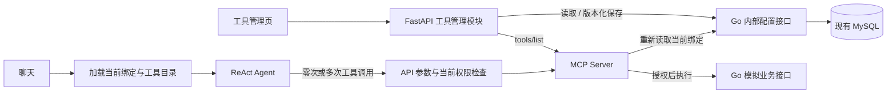

# Agent 工具管理与统一 ReAct（2026-10-08）

本变更已经用户确认，替代早期“语义 Router 预选一个 Tool”的聊天入口。历史任务 7、8、13 的路由方案保留为演进记录，不再是运行时要求。

后续 Endpoint 增量已将全局单连接/名称绑定升级为来源 ToolRef 和签名 v2，详见 [Endpoint 实施记录](mcp-endpoints-tasks.md)。本文接口与旧验证数量是当时版本记录，不是当前接口清单。

## 需求

- REQ-MGMT-01：管理员能查看 MCP 实际返回的全部五个工具，按 CRM、MES、知识、工作流分组，并按名称、描述模糊搜索。
- REQ-MGMT-02：管理员能给 `consultant` 勾选、取消、保存工具；空工具集有效，重复、未知或契约不兼容工具不能保存。新增 MCP 工具不会自动绑定。
- REQ-MGMT-03：绑定在重启后保留；并发编辑不得静默覆盖。解绑成功后，后续调用（包括已开始的 Agent 循环）不得继续使用旧授权。
- REQ-MGMT-04：每条聊天消息进入同一个 ReAct 运行时。Agent 可直接回答问候、追问缺失参数，或自主组合已绑定工具；不要求先选 `direct_tool/skill/clarification`。
- REQ-MGMT-05：运行时工具集合取已绑定、契约匹配、当前已实现能力的交集。SOP 与审批工作流可绑定，但必须明确标记未接通，不声称可执行。
- REQ-MGMT-06：Agent API 与 MCP 各自检查当前绑定版本、工具名称、参数和风险；无审批的写操作继续拒绝。工具管理接口不注册为模型可调用 Tool。
- REQ-MGMT-07：无实时天气工具时不得编造天气；业务事实只来自真实 Tool Observation。界面区分普通回复和实际工具结果，不展示模型内部推理。
- REQ-MGMT-08：管理页仅用于本地开发环境；拒绝非本机管理请求和非本机 Origin，不构建生产登录系统。

## 设计

不增加服务进程或数据库。Go 新增 `agent_profiles`、`agent_binding_audits` 表，配置与模拟业务数据分表。初始化只在配置不存在时创建 `consultant` 和两个 CRM 工具，重复启动/种子不覆盖人工配置。保存使用 `expected_version` 乐观锁并在同一事务追加变更审计。

公开接口：`GET /api/admin/tools`、`GET /api/admin/agents`、`PUT /api/admin/agents/{id}/tools`。目录来自官方 MCP Client 的 `tools/list`，本地固定 Registry 补充风险/已实现状态并验证输入契约；MVP 工具数仍为五个。配置接口走既有内部服务令牌，浏览器不接触令牌。

运行时签名上下文新增 `route=agent` 和 `binding_version`。API 在每次调用前重新读取配置；MCP 在签名/参数校验后独立读取相同配置，校验版本、工具集合和当前工具。任一依赖失败均不使用静态旧策略放行。原静态 Role/Skill 配置暂保留用于后续 Skill 开发，不能绕过动态绑定。

Agent 的工具参数由模型提出并进行严格 Schema 校验，不再与 Router 提取参数比较。有限循环和工具调用次数限制避免失控。返回 `route.kind=agent` 仅是运行方式标记，`tool_calls` 为实际工具调用记录，零调用也可正常回答。无会话记忆仍是当前边界。

## 实施任务（每项 2–4 小时）

- [x] M1：Go 配置存储与内部接口。文件：`internal/store`、`internal/transport/agents.go`。验收：重启保留、空集、版本冲突、事务审计测试通过。依赖：既有 MySQL。
- [x] M2：MCP 动态授权与目录发现。文件：`mcp-server/src/security.ts`、`backend.ts`、Python `clients`。验收：绑定/解绑、旧版本、伪造上下文、写操作拦截测试通过。依赖：M1。
- [x] M3：工具管理 API 与统一 ReAct。文件：`services`、`api`、`main.py`。验收：问候零调用、多工具组合、错误参数、未知角色和实时撤权测试通过。依赖：M2。
- [x] M4：React 管理页与调用结果展示。文件：`ToolManager.tsx`、`App.tsx`、`api.ts`、样式和测试。验收：搜索、分组、保存、冲突/离线提示、端到端绑定后查询通过。依赖：M3。

Skill、RAG、Task 审批和 Compose 全栈启动继续按原任务推进；本变更不把未完成能力标为完成。

## 验证记录（2026-10-08）

- Go：配置持久化、启动不覆盖、空集合、非法工具、版本冲突、变更审计和业务查询测试通过。
- MCP：12 项测试通过；动态版本校验、撤权、合法 MES 绑定、服务故障、无审批写操作拒绝均覆盖。
- Python：51 项通过，1 项真实服务联调默认跳过；随后该真实 MCP → Go → MySQL 联调单独通过。
- Web：5 项测试通过，类型检查与构建通过；真实浏览器验证目录、保存/恢复、搜索、移动布局，无 JS 异常。
- DeepSeek：真实问候零工具调用通过；同轮两个 CRM 查询工具通过。天气的额外真实模型冒烟因自动审批额度不足未执行，不计为通过。

原规则/LLM Router 模块和对应分类测试已移除，新入口测试覆盖统一 ReAct 行为。旧设计保留在历史任务记录中；当前目录没有 Git 历史，旧代码不能通过 Git 回退。
