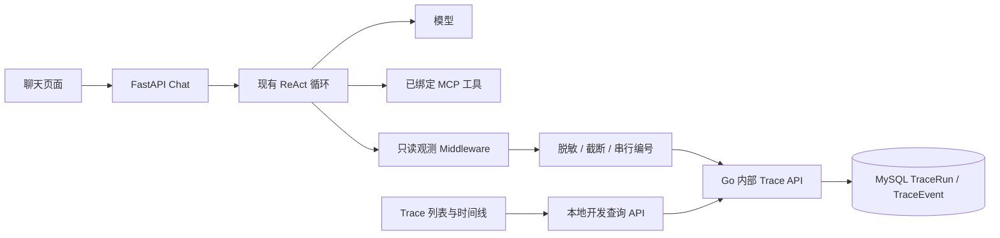

# Trace 设计

## 架构

每个 HTTP 聊天请求产生独立 Trace ID；请求 ID 是检索字段，不作为所有权或唯一主键。所有请求仍走 ReAct，Trace 不参与工具选择、授权和执行。

## 事件与状态

事件为 user_message、system_message、model_start、assistant_message、tool_call、tool_start、tool_result、tool_error、tool_rejected、model_error、final_response。模型步骤编号区分多次调用；call_id 加步骤编号关联提议与结果。模型文本和最终服务端展示文本分别记录。工具别名附带业务名称、endpoint 与修订，activate_skill 单独标识为本地控制工具。

Python 在观测点串行保存事件，Go 事务分配递增 sequence，实际完成顺序是展示顺序；并行调用不伪装为串行。事件 UUID 保证重复提交幂等。状态 running → succeeded / failed / cancelled；15 分钟未更新的 running 记录标记 interrupted、不完整，不推断业务操作成功与否。

## 边界与安全

查询复用本机开发管理保护，Go 内部接口要求服务令牌、角色和 actor 所有权。不是生产鉴权。仅捕获公开消息 content 和明确字段，不保存 reasoning_content、模型隐藏推理、原始请求头、租约或工具凭证。保存前递归脱敏、已知环境密钥替换和文本凭证脱敏。单事件最多约 16 KB、单轮最多 256 事件，截断明确标记。

Trace 故障不能触发重放或改变业务结果；尽力将记录标记 incomplete，并在聊天响应标记采集不完整。失败记录只保存安全错误码。后台 Task 只关联 task_id，不冒充完整后台 Trace。

## 接口与前端

- 内部 POST /internal/traces；POST /:id/events；POST /:id/finish。
- 本地 GET /api/traces：请求 ID 模糊搜索、分页；GET /api/traces/:id：按 after_sequence 增量读取。
- ChatResponse 增加 trace_id、trace_incomplete；失败响应包含 X-Trace-ID。
- React 增加 Trace 导航、列表、时间线、折叠详情；运行中轮询，hash 保存选中的 Trace，聊天提供成功/失败跳转。

选择复用现有 Go/MySQL，而不是另装观测平台；使用现有 LangChain middleware 拦截真实模型与工具边界，不另造 Agent 循环。参考：[官方 middleware 文档](https://docs.langchain.com/oss/python/langchain/middleware/custom)。

## 验证

Go：持久化、幂等、严格输入、所有权、分页、事件上限与终态。
Python：真实 ReAct 消息、并行完成顺序、权限拒绝、模型/工具失败、脱敏、采集故障不改变业务语义。
React：列表详情、增量刷新、失败、空/截断消息与跳转；实际本地链路验证 MySQL 持久化和页面展示。测试数据均为模拟数据。
