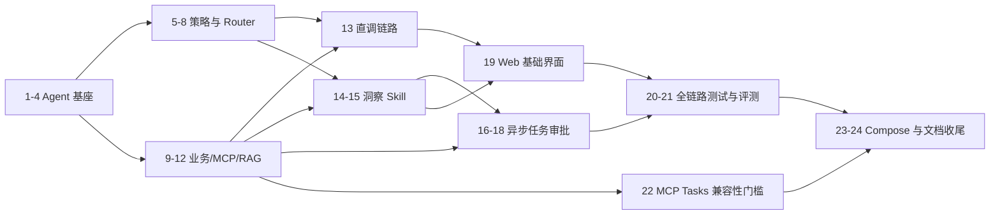

# OpsPilot：MVP 实施任务清单

当前新增任务 M1–M4 见 [工具管理变更规格](docs/changes/tool-management.md)。历史已完成的 Router 任务仅记录当时实现，新聊天入口由统一 ReAct 与可管理的工具绑定替代。

Endpoint 现行角色归属修正及 R1–R3 验证见 [角色 Endpoint 修正](docs/changes/role-endpoints.md)；[E1–E5](docs/changes/mcp-endpoints-tasks.md) 保留旧领域连接版本的历史记录。

## 1. 执行规则

- 任务严格按依赖顺序执行；一个任务完成后，先运行该任务列出的验证命令或等效检查，通过后才进入下一项。
- 每项预计工作量为 2–4 小时；若超出，先拆分任务并更新本文档，不静默扩大范围。
- 所有业务数据、SOP、Fixture 和截图仅使用项目生成的模拟数据。
- `main` 路径优先保证可运行、可测试、可解释；不在 MVP 中加入 DSH、DeepAgents、Kubernetes、多 Agent、消息队列或额外 Tool。
- MCP Tasks 只能在任务 22 的官方兼容性验证通过后使用该名称；此前统一称“异步任务编排”。

## 2. 依赖总览



## 3. 任务清单

### 里程碑 A：Agent 基座先可调用模型

- [x] **1. 初始化仓库与开发约定**（2–3 小时）
  - 创建根目录结构、`.gitignore`、`.env.example`、格式化与静态检查配置；提交 `requirements.md`、`design.md`、`tasks.md` 作为规格基线。
  - 建立 `apps/agent-api` 的 Python 包与测试骨架，不接入业务服务或 Tool。
  - 涉及文件：根目录配置、`apps/agent-api/pyproject.toml`、`apps/agent-api/app/`、`apps/agent-api/tests/`。
  - 验收：环境示例不含真实密钥；Python 格式化、静态检查与空测试集可执行。
  - 依赖：无。
  - 对应：REQ-DATA-03、REQ-RUN-03、REQ-TEST-04。

- [x] **2. 实现 FastAPI 服务骨架与健康检查**（2–3 小时）
  - 添加配置加载、结构化日志、统一错误响应和 `GET /api/health`；配置错误时安全失败。
  - 定义 `request_id` 中间件，不记录 Authorization Header、Token 或 API Key。
  - 涉及文件：`apps/agent-api/app/main.py`、`api/health.py`、`core/config.py`、`core/logging.py`、测试文件。
  - 验收：健康检查返回服务版本与安全状态；非法配置返回无秘密的错误；每个响应含 `request_id`。
  - 依赖：1。
  - 对应：REQ-RUN-01–03、REQ-SAFE-02–04。

- [x] **3. 实现 LangChain 模型集成与最小聊天接口**（3–4 小时）
  - 使用 `langchain-openai` 的 OpenAI 兼容 Chat Model 实现环境变量配置、超时与错误映射；添加 `POST /api/chat` 的纯文本回显/最小模型调用路径。
  - 不在此任务中实现 Router、Tool 或 Skill；模型输出只作为普通文本返回。
  - 为测试提供 Fake LLM Client，避免单测请求外部服务。
  - 涉及文件：`clients/llm.py`、`api/chat.py`、`models/chat.py`、单元测试。
  - 验收：配置有效时可通过 Fake Client 或本地兼容端点完成一次请求；无 API Key 时返回明确受限能力错误且不泄密；超时映射为可重试依赖错误。
  - 依赖：2。
  - 对应：REQ-RUN-02–03、REQ-SAFE-02、REQ-UI-01。

- [x] **4. 建立 LangChain ReAct Agent 最小可测试基座**（2–3 小时）
  - 使用 `langchain.agents.create_agent` 建立 ReAct Agent，并由 LangGraph 运行；测试中注入仅供测试的 Fake Tool 验证“模型选择 Tool → Observation → 最终回答”循环。
  - 该 Fake Tool 不注册为产品 Tool；保持 `POST /api/chat` 的最小模型路径，明确区分“模型/Agent 基座”与后续业务 Skill。
  - 涉及文件：`agent/graphs/base_chat.py`、`agent/state.py`、测试文件。
  - 验收：Fake LLM 下 ReAct Agent 可调用 Fake Tool 并根据 Observation 返回预期结构化状态；图错误会转换为统一错误；产品 Tool Registry 仍为空。
  - 依赖：3。
  - 对应：技术约束、REQ-TEST-01。

### 里程碑 B：策略、注册表与安全 Router

- [x] **5. 定义并校验 Role、Skill 与 Tool 配置**（3–4 小时）
  - 创建初始 `roles.yaml`、`skills.yaml` 与 Python 配置 Schema，完整表达开发者手动绑定的 Role Tool 总集、`consultant` 直调子集和两个 Skill 的固定授权集。
  - 定义 Agent Tool Registry 元数据：名称、输入模型、风险、MCP 映射；启动时拒绝非法/重复配置。
  - 涉及文件：`config/roles.yaml`、`config/skills.yaml`、`policy/config_models.py`、`tools/registry.py`、测试文件。
  - 验收：配置可加载；不存在 Skill、重复 Tool、未知 Tool、Role 总集缺少直调/Skill 所需 Tool、写 Tool 风险不匹配均导致安全失败；MES Tool 存在但未授予 `consultant`。
  - 依赖：1、2。
  - 对应：REQ-POLICY-01–03/08、REQ-AUTH-01、REQ-TEST-01。

- [x] **6. 实现 PolicyEngine 与 Binding Resolver**（3–4 小时）
  - 实现 Role 手动绑定总集→直调 Tool 或 Skill Tool 的交集计算，输出不可扩张的 `AllowedToolBinding`。
  - 将 Tool 参数 Schema、风险和写操作审批前置条件加入 Resolver；输出原因码以便审计。
  - 涉及文件：`policy/engine.py`、`policy/binding.py`、`models/policy.py`、测试文件。
  - 验收：直调只允许两个 CRM Tool；客户洞察只允许三个 Tool；回访 Skill 只允许四个 Tool；`consultant` 请求 MES 失败；非法参数与无审批写入失败。
  - 依赖：5。
  - 对应：REQ-POLICY-02–08、REQ-AUTH-01–03、REQ-SAFE-01/05。

- [x] **7. 实现确定性 Router 与澄清路径**（3–4 小时）
  - 为四个固定演示请求实现规则化意图与标识提取，输出受 Schema 约束的 `direct_tool`、`skill` 或 `clarification`。
  - 缺失 ID、非法 ID、多个候选动作和无匹配文本必须走澄清，不调用下游。
  - 涉及文件：`agent/router/rules.py`、`agent/router/models.py`、`agent/router/service.py`、测试文件。
  - 验收：四个指定请求分别命中要求的路由；“查询客户信息”返回澄清；错误标识不产生 Tool 调用；Router 返回符合联合 Schema。
  - 依赖：6。
  - 对应：REQ-DIRECT-01/04、REQ-INSIGHT-01、REQ-WF-01、REQ-POLICY-04。

- [x] **8. 增加受限 LLM Router 回退与审计事件模型**（3–4 小时）
  - 对规则未覆盖但可解释的请求增加 Structured Output LLM Router；只接受既定路由枚举与已注册名字。
  - 接入 `route_selected`、`route_clarification`、`policy_denied` 事件写入接口；LLM 失败/低置信度回退澄清。
  - 涉及文件：`agent/router/llm.py`、`audit/service.py`、`audit/models.py`、测试文件。
  - 验收：Fake LLM 的合法输出受 Policy 校验；伪造 Tool/Skill、解析失败、低置信度都会澄清；审计事件不含秘密。
  - 依赖：3、6、7。
  - 对应：REQ-POLICY-04–06、REQ-SAFE-03–04、REQ-TEST-01。

### 里程碑 C：模拟业务、MCP 与 RAG 基础能力

独立 MCP Tool 可先于 Go/RAG 实现并用假下游验证；在二次策略校验完成前，正式 MCP 入口只允许列出 Tool，不允许执行业务调用。完成本里程碑仍需任务 9、10、12、13。

- [x] **9. 搭建 MySQL、Go 服务与确定性模拟数据**（3–4 小时）
  - 已验证：独立 MySQL 8.4 容器上完成迁移、两次固定日期种子与 Go 集成测试；`C1001` 为高风险且续费日为 2026-10-05。回访草稿/计划表已迁移，审批流程运行前保持空表。
  - 创建 Go + Gin + GORM 服务、迁移及幂等种子脚本，生成客户、工单、生产工单；预建回访草稿/计划表，审批前不预置有效计划。
  - 为 `C1001` 和其他场景客户设计固定的风险、续费时间、开放工单数据；不使用任何外部数据。
  - 涉及文件：`apps/business-service/` 中的 GORM 模型/迁移、Go 模拟数据种子与 SQLite/MySQL 测试；不另设 SQL 初始化脚本或复制种子 Fixture。
  - 验收：干净数据库可重复生成相同业务标识和特征；基础查询可返回 C1001；种子中无非公开或真实数据。
  - 依赖：1。
  - 对应：REQ-DATA-01–04、REQ-RUN-01。

- [ ] **10. 实现 Go 限定 REST 业务接口与领域校验**（3–4 小时）
  - 当前进度：三条只读接口及服务令牌/请求标识校验已完成；回访草稿和审批后提交接口待完成。
  - 实现客户概览、开放工单、MES 工单读取以及回访草稿创建/提交的内部接口。
  - 禁止通用查询；计划提交必须满足有效服务身份、资格、审批证明与 `task_id + customer_id` 幂等约束。
  - 涉及文件：`internal/crm/`、`internal/mes/`、`internal/workflow/`、`internal/transport/`、测试文件。
  - 验收：open 查询不返回关闭工单；不存在返回 404；无效证明/不合资格/重复提交不创建有效计划。
  - 依赖：9。
  - 对应：REQ-DIRECT-02/05、REQ-WF-05–09、REQ-SAFE-01/05。

- [x] **11. 搭建 TypeScript MCP Server 与 Tool Schema**（3–4 小时）
  - 建立官方 MCP SDK 的 Streamable HTTP Server；按 CRM、MES、知识、工作流域使用 Zod 注册五个独立 Tool，并定义输出 Schema；不使用 GraphQL。
  - 添加 MCP 内 Tool Registry 与 Agent Registry 契约指纹比对所需元数据；此任务仅完成本地假下游调用。
  - 涉及文件：`apps/mcp-server/src/{server,tools,schemas,transport}`、`package.json`、测试文件。
  - 验收：官方 MCP 测试客户端通过 Streamable HTTP 能列出恰好五个 Tool；每个非法输入被 Zod 拒绝；无任意 SQL/HTTP/GraphQL Tool；真实下游与二次授权未接通前正式入口拒绝执行。
  - 依赖：1、5。
  - 对应：REQ-POLICY-05、技术约束、REQ-TEST-01。

- [ ] **12. 接通 MCP 二次策略校验与 Go 业务适配**（3–4 小时）
  - 当前进度：只读工具已完成签名上下文、MCP 本地策略镜像/Schema/契约指纹校验、Go 固定 REST 和 RAG 适配；客户洞察最小集合在 API/MCP 双侧校验。工作流审批写入仍待后续任务，故本项未全部完成。
  - 将 MCP Tool 映射到 Go 内部 REST，加载策略镜像并校验签名调用上下文、过期时间、Role/Skill/Tool 交集和参数。
  - 增加启动期策略版本、Tool Schema 指纹一致性检查；拒绝来自 Web/模型的伪造上下文。
  - 涉及文件：`mcp-server/src/{policy,clients,tools}`、共享契约 Fixture、测试文件。
  - 验收：授权 CRM 读取成功；`consultant` 的 MES 调用在 MCP 层被拒绝；伪造 Role、过期签名、Schema 指纹不一致和越权 Tool 均失败；MCP 不直接暴露 Go 地址。
  - 依赖：6、10、11。
  - 对应：REQ-POLICY-05–06、REQ-AUTH-01–03、REQ-SAFE-05。

- [x] **13. 建立 SOP 语料、Qdrant 索引和内部检索接口**（3–4 小时）
  - 已验证：三份自编 SOP、11 个片段，本地 BGE 中文 Embedding 与真实 Qdrant 重复索引同一 collection；真实 MCP 检索与源文件引用校验通过。控制逻辑的空结果、故障和篡改测试通过；不宣称检索准确率。
  - 编写自创模拟 SOP Markdown，包含可验证的文档 ID/版本；实现切分、Embedding、索引与重建脚本。
  - FastAPI 提供仅供 MCP Server 调用的内部 RAG 检索接口，结果含文档、chunk、原文片段与分数。
  - 涉及文件：`data/sop/`、`app/rag/{corpus,service,ingest}.py`、`scripts/dev.py index-sop`、`infra/compose.rag.yaml`、测试文件。
  - 验收：固定查询能返回预期 SOP 片段；重新索引幂等；空结果明确；Qdrant 不可用时安全失败。
  - 依赖：2。
  - 对应：REQ-INSIGHT-04–06、技术约束、REQ-SAFE-02。

### 里程碑 D：最小端到端读取与洞察

- [x] **14. 完成 `direct_tool` 端到端链路**（3–4 小时）
  - 已验证：两个指定查询使用单工具 ReAct Loop，经官方 Python MCP Client、TypeScript MCP、Go REST 和真实模拟 MySQL 返回 C1001 数据；空工单、非法编号、缺失客户、MES 越权均有测试，联调后回访草稿/计划表计数仍为 `0/0`。真实 DeepSeek 调用未测试，使用确定性假模型验证 Agent Loop。
  - 将 `POST /api/chat` 的 Router、Binding、MCP Client、MCP Server、Go 服务和统一响应接通。
  - 对每条直接查询创建仅注入对应 CRM Tool 的 ReAct Agent，通过 Agent Loop 调用 MCP；不加载任何 Skill。
  - 涉及文件：Agent API 的 `api/chat.py`、`clients/mcp.py`、响应模型、集成测试。
  - 验收：两个指定直接查询均经过 ReAct Agent Loop，且分别只产生一个对应 Tool 调用；C1001 结果正确；空工单、非法 ID、MES 越权均按约定返回且无写入。
  - 依赖：7、8、12。
  - 对应：REQ-DIRECT-01–06、REQ-AUTH-01、REQ-UI-05、REQ-TEST-02。

- [x] **15. 实现客户洞察 ReAct Agent 与证据引用校验**（3–4 小时）
  - 沿用同一 LangChain `create_agent` / LangGraph ReAct；显式/模型自主启用后仅注入当前角色绑定与 Skill 的交集，不建立独立 Router 或新 Agent。
  - 实现 Citation 验证器，确保 chunk、文档和展示片段均来自本次检索结果。
  - 涉及文件：`agent/{skills,citations,react}.py`、`services/{chat,tool_management}.py`、响应模型、单元/集成测试。
  - 验收：指定洞察请求使用且只使用三个允许 Tool（不强制固定调用顺序）；引用标识和原文属于本轮真实结果；伪造/旧轮次引用使建议被丢弃；无 SOP 证据时只返回事实与限制。语义充分性仍需后续评测，不宣称由身份校验证明。
  - 依赖：4、6、12、13。
  - 对应：REQ-INSIGHT-01–06、REQ-POLICY-03/07、REQ-TEST-01–02。

- [ ] **16. 加入 Redis 的受限缓存、短会话与幂等机制**（2–3 小时）
  - 缓存只读 Tool 响应和短会话摘要；为审批/取消接口加入幂等键存储与请求去重。
  - 确保 Redis 未命中或不可用时可降级到 MySQL/实时调用，绝不从 Redis 判断授权或审批。
  - 涉及文件：`cache/redis.py`、`sessions/service.py`、`tasks/idempotency.py`、测试文件。
  - 验收：缓存命中不改变数据语义；Redis 清空后直调仍正确；重复相同幂等请求不产生两次写入。
  - 依赖：2、14。
  - 对应：技术约束、REQ-SAFE-05、REQ-TEST-03。

### 里程碑 E：异步任务、人工确认与审计

- [ ] **17. 实现 Task、审批与审计持久化模型**（3–4 小时）
  - 创建 Agent 侧迁移和 Repository：`agent_tasks`、`task_approvals`、`audit_events`；实现状态转换与乐观锁。
  - 规定合法状态转换、Task TTL、终态不变性和追加式审计。
  - 涉及文件：`tasks/{models,repository,state_machine}.py`、`audit/`、迁移、测试文件。
  - 验收：非法跳转、终态二次审批、过期 Task 均失败；审计按时间与 Task 可查询；事件不含秘密。
  - 依赖：2、6、9。
  - 对应：REQ-WF-06–10、REQ-SAFE-03–04、REQ-TEST-01。

- [ ] **18. 实现回访工作流的 ReAct 提案阶段**（3–4 小时）
  - 构建回访 LangGraph 外壳并计算 `[today, today+7]`（含两端）窗口；在其中运行注入四个绑定 Tool 的 ReAct Agent，由 `workflow.create_followup_plan(operation=propose)` 的 Go 业务逻辑按高风险与到期窗口筛选候选、创建内部草稿，再用客户/工单/SOP Tool 丰富提案并落库 Task。
  - 无候选时产生 `completed_empty`，不得创建草稿或计划；有候选时转 `pending_approval`。
  - 涉及文件：`agent/graphs/followup.py`、`tasks/service.py`、MCP Tool 调用、集成测试。
  - 验收：固定种子中生成可审查提案，日期范围可见；审批前 `followup_plans` 为零；空候选场景正确结束。
  - 依赖：12、13、15、17。
  - 对应：REQ-WF-01–06、REQ-INSIGHT-04、REQ-TEST-02。

- [ ] **19. 实现批准、拒绝、取消与批准后提交**（3–4 小时）
  - 实现 Task 查询、批准、拒绝、取消 API；批准路径生成一次性审批证明、重新校验资格与草稿，再经 MCP `commit` 写入。
  - 在 MCP 与 Go 两侧验证证明、Task 版本、审批状态、草稿有效期及幂等约束。
  - 涉及文件：`api/tasks.py`、`tasks/approval.py`、MCP workflow Tool、Go workflow 服务、E2E 测试。
  - 验收：批准后恰好生成一份计划与审计；拒绝/取消/过期/客户资格变化/重复批准均不写入或不重复写入；响应可显示 CRM 计划 ID。
  - 依赖：16、17、18。
  - 对应：REQ-WF-07–10、REQ-SAFE-05、REQ-TEST-02–03。

### 里程碑 F：Web、验证、发布准备

- [ ] **20. 实现 React 最小界面与 Task 轮询**（3–4 小时）
  - 当前进度：React + TypeScript 前端可运行，已接通只读查询、客户洞察快捷入口、聊天、工具记录、结构化数据、错误与请求 ID；引用卡片展示服务端校验的编号/版本/来源/原文。回访计划入口仍标为未接通；Task API/轮询与审批交互未实现，因此本项仍未完成。
  - 实现聊天、四个快捷操作、路由/结果展示、引用来源卡片和 Task 状态面板。
  - Task 状态使用轮询；只显示后端已授权的批准、拒绝、取消操作。
  - 涉及文件：`apps/web/src/{features/chat,features/tasks,components,api}`、组件测试。
  - 验收：浏览器可运行四个预填请求；引用显示文档和原文片段；Task 在无需刷新页面情况下更新，审批前不显示已创建计划。
  - 依赖：14、15、19。
  - 对应：REQ-UI-01–05、REQ-WF-10。

- [ ] **21. 建立端到端与浏览器测试套件**（3–4 小时）
  - 为 compose 测试环境编写服务集成测试与 Playwright 浏览器测试；固定使用 Fake LLM/结构化响应避免网络与随机性。
  - 覆盖四个演示、越权 MES、参数错误、无依据回答、审批前零写入、拒绝/取消与重复提交。
  - 涉及文件：各服务集成测试、`apps/web/e2e/`、测试 Compose 配置。
  - 验收：单元、集成、浏览器测试可通过单个文档化命令运行；失败日志可定位到服务与 `request_id`。
  - 依赖：14、15、19、20。
  - 对应：REQ-TEST-01–04。

- [ ] **22. 建立 30+ 用例评测与 MCP Tasks 兼容性验证**（3–4 小时）
  - 创建不少于 30 条评测 Fixture 和运行器，按需求分类断言 route、Tool/Skill、引用、Task 状态和写入副作用。
  - 使用官方 MCP Tasks 示例与所选 SDK/Inspector 组合，真实验证任务创建、`tasks/get`、输入确认/更新和取消；将命令、版本、原始结果写入兼容性记录。
  - 涉及文件：`evals/`、`scripts/run-evals`、`scripts/verify-mcp-tasks`、`docs/mcp-tasks-compatibility.md`。
  - 验收：评测输出通过/失败/跳过明细与可复现汇总；兼容性证据完整。未全部通过时文档仅使用“异步任务编排”。
  - 依赖：19、21、11。
  - 对应：REQ-EVAL-01–02、技术约束、REQ-TEST-04。

- [ ] **23. 完成 Docker Compose 一键启动与运行时健壮性**（3–4 小时）
  - 完成所有 Dockerfile、Compose 健康检查、依赖顺序、持久卷、初始化和重置命令；确保仅 Web/Agent API 暴露宿主端口。
  - 验证空 LLM Key 下直接 Tool、策略、Task 状态和离线测试仍可工作，洞察建议明确降级。
  - 涉及文件：`docker-compose.yml`、各 Dockerfile、`.env.example`、启动脚本、运行验证记录。
  - 验收：干净环境一条命令启动并完成种子/索引；重启后 Task/审计/计划持久；内部依赖无主机端口暴露；无密钥不泄露且降级明确。
  - 依赖：9–21。
  - 对应：REQ-RUN-01–03、REQ-SAFE-02–04、技术约束。

- [ ] **24. 编写 README、架构说明与发布前安全检查**（3–4 小时）
  - 完成目录说明、架构图、环境变量、启动/停止/重置、演示场景、权限与审批模型、评测结果、边界和后续计划。
  - 增加秘密扫描、许可证/依赖检查和公开数据自检；README 中只报告第 22 项实际产生的评测结果与 MCP Tasks 结论。
  - 涉及文件：`README.md`、`docs/architecture.md`、安全检查脚本、CI 配置（如需要）。
  - 验收：从 README 可复现启动、四个演示与评测；扫描未发现密钥或非公开数据；所有 MCP Tasks 表述与兼容性记录一致。
  - 依赖：22、23。
  - 对应：REQ-DATA-03、REQ-EVAL-02、README 要求、REQ-SAFE-04/06。

## 4. 第一个实施切片

任务 1–4 是下一步要执行的完整切片。完成后应能证明：

```text
环境变量 → FastAPI 健康检查 → LangChain 模型集成 → 最小聊天接口 → ReAct Agent 最小循环
```

它不含产品业务 Tool、MCP、RAG 或写操作，因此可以先隔离验证 ReAct 循环、模型调用、超时、配置和错误脱敏。任务 5 之后才开始引入权限和业务能力。
